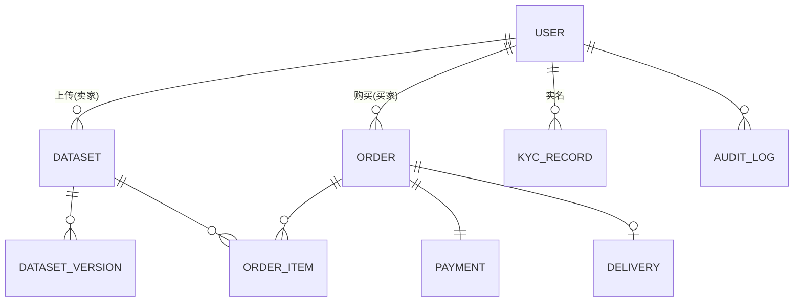

# Step 4 - ER 图 + 详细接口定义 + 第一版 PR 计划

**日期**：2026-05-31  
**范围**：仅针对 P3 MVP

---

## 1. 核心 ER 图（文字版 + Mermaid）

### 核心实体关系

```
User (1) ----< KycRecord (1)
User (1) ----< Dataset (N)          // 卖家
User (1) ----< Order (N)            // 作为买家
User (1) ----< Order (N)            // 作为卖家（通过 Dataset）

Dataset (1) ----< DatasetVersion (N)
Dataset (1) ----< OrderItem (N)

Order (1) ----< OrderItem (N)
Order (1) ----< Payment (1)
Order (1) ----< Delivery (1)

User (1) ----< AuditLog (N)
```

### Mermaid ER 图



**关键字段提示**（P3 阶段简化版）：

- **User**: id, email/phone, password_hash, role (buyer/seller/both), kyc_status, created_at
- **Dataset**: id, seller_id, title, description, data_type (text/code), license_type, suggested_price, status (draft/reviewing/published/rejected), file_size, sample_count
- **Order**: id, buyer_id, seller_id, total_amount, platform_fee (10%), status, created_at
- **Payment**: id, order_id, provider (wechat/alipay/stripe), amount, status, transaction_id, escrow_status
- **AuditLog**: id, user_id, action, resource_type, resource_id, ip, created_at

---

## 2. 更详细的接口定义（优先级最高的前几个模块）

### 2.1 用户体系

**POST /api/v1/auth/register**
```json
{
  "account": "138xxxx8888",
  "password": "xxxxxx",
  "account_type": "phone" | "email"
}
```

**POST /api/v1/users/me/kyc**
```json
{
  "type": "personal" | "company",
  "id_card_front": "url",
  "id_card_back": "url",
  "real_name": "张三"
}
```

### 2.2 数据集上传（最核心）

**POST /api/v1/datasets**
```json
{
  "title": "高质量中文互联网文本 2025Q1",
  "description": "...",
  "data_type": "text",
  "license_type": "commercial",
  "suggested_price": 2999,
  "sample_count_estimate": 1200000,
  "tags": ["中文", "互联网", "LLM"]
}
```

**分片上传流程**：
1. POST `/api/v1/datasets/{id}/upload/init` → 返回 upload_id + 分片大小建议
2. PUT `/api/v1/datasets/{id}/upload/part?upload_id=xxx&part_number=1` （body 为文件分片）
3. POST `/api/v1/datasets/{id}/upload/complete`

### 2.3 订单与支付（资金托管关键）

**POST /api/v1/orders**
```json
{
  "dataset_id": "xxx",
  "license_type": "commercial",
  "agreed_price": 2999,
  "note": "用于训练 Qwen3"
}
```

**支付创建**：
POST `/api/v1/payments/create`
→ 返回支付二维码 / 支付链接 + 支付订单号

**买家确认**：
POST `/api/v1/orders/{id}/confirm-delivery`

触发：
- 平台扣 10%
- 结算给卖家
- 记录结算流水

---

## 3. 第一版 PR 计划（可独立评审合并）

按**依赖顺序 + 价值顺序**排列，建议按这个顺序开发和提 PR。

### Phase 0 - 基础设施（必须最先做）

| PR | 标题 | 主要内容 | 依赖 |
|----|------|----------|------|
| PR-01 | 项目脚手架 + 基础架构 | Go 项目结构、Next.js 项目、Docker Compose、CI 基础 | 无 |
| PR-02 | 数据库初始化 + 迁移 | PostgreSQL 表结构（User, Dataset, Order 等基础表）+ 迁移工具 | PR-01 |
| PR-03 | 统一响应、错误码、日志、中间件 | 标准 API 响应格式 + 全局错误处理 + 请求日志 | PR-01 |

### Phase 1 - 用户基础（P3 地基）

| PR | 标题 | 主要内容 | 依赖 |
|----|------|----------|------|
| PR-04 | 用户注册登录 + JWT | 注册、登录、Refresh Token、JWT 中间件 | PR-02, PR-03 |
| PR-05 | 用户资料 + 实名认证基础 | 资料编辑 + KYC 提交接口（不接真实认证） | PR-04 |
| PR-06 | RBAC 权限基础 | 角色定义 + Casbin 或简单中间件 | PR-04 |

### Phase 2 - 数据集核心（最大价值）

| PR | 标题 | 主要内容 | 依赖 |
|----|------|----------|------|
| PR-07 | 数据集元数据 CRUD | 创建、编辑、详情、列表 | PR-05 |
| PR-08 | 大文件分片上传 + 断点续传 | 上传初始化、分片、合并、进度查询 | PR-07 |
| PR-09 | 基础质量检测任务 | 上传完成后触发异步任务（格式 + 简单统计） | PR-08 |
| PR-10 | 后台数据集审核流程 | 运营审核接口 + 状态流转 + 通知 | PR-09 |

### Phase 3 - 交易闭环（商业闭环）

| PR | 标题 | 主要内容 | 依赖 |
|----|------|----------|------|
| PR-11 | 订单创建与状态机 | 创建订单、订单状态流转 | PR-10 |
| PR-12 | 支付集成（先做一个渠道） | 微信支付集成 + 回调 + 支付记录 | PR-11 |
| PR-13 | 资金托管 + 结算逻辑 | 支付成功后进入托管、确认后结算 10% 佣金 | PR-12 |
| PR-14 | 数据交付（临时链接 + 水印） | 生成下载链接 + 简单水印注入 | PR-13 |

### Phase 4 - 完善与打磨（可上线）

| PR | 标题 | 主要内容 | 依赖 |
|----|------|----------|------|
| PR-15 | 多支付渠道支持 | 支付宝 + Stripe | PR-13 |
| PR-16 | 搜索与筛选优化 | 基础筛选 + 关键词搜索 | PR-10 |
| PR-17 | 卖家收益中心 | 收益统计、可提现金额、提现申请 | PR-13 |
| PR-18 | 审计日志 + 基础风控 | 关键操作审计 + 简单风控规则 | 全量 |

**建议合并策略**：
- 每个 PR 尽量控制在 1-2 个主要功能点
- PR-01 ~ PR-06 可以较快合并（基础）
- PR-07 ~ PR-14 是 P3 的**核心价值交付**，建议每个 PR 都经过评审

---

## 4. 推荐的开发顺序建议（给团队）

1. 先做 **PR-01 ~ PR-03**（基础设施）
2. 立刻并行做 **验证点**（分片上传 + 支付托管）
3. 再做 **PR-04 ~ PR-06**
4. 重头做 **PR-07 ~ PR-14**（这个阶段最花时间）
5. 最后做完善类 PR

---

**完成 1-4 步骤总结**：

所有四个步骤已按顺序完成：

- Step 1：设计文档已根据你的决策更新
- Step 2：P3 用户故事 + 粗接口已拆解完成
- Step 3：技术栈 + 6 大验证点已明确
- Step 4：ER 图 + 详细接口 + 可执行 PR 计划已产出

所有文档都放在 `/Users/lei/ai-data-marketplace/docs/` 目录下。

现在你可以：
- 直接把这些文档发给团队
- 开始评估工作量
- 启动技术验证（强烈建议先做支付托管和分片上传）

需要我帮你把这些内容整理成更简洁的版本（比如一份给团队看的 2 页 PDF 大纲），还是直接开始帮你生成某个模块的代码骨架？随时说。