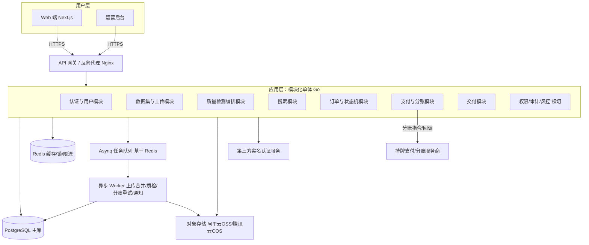
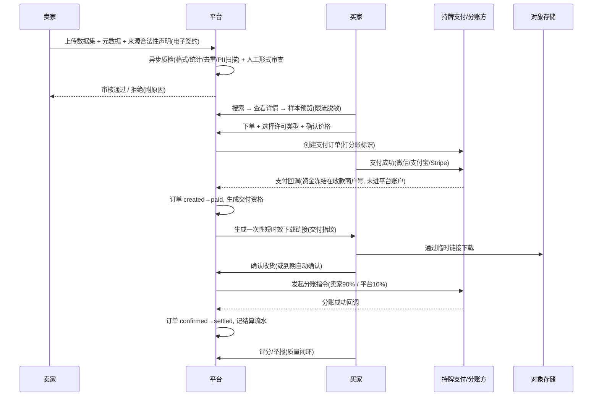
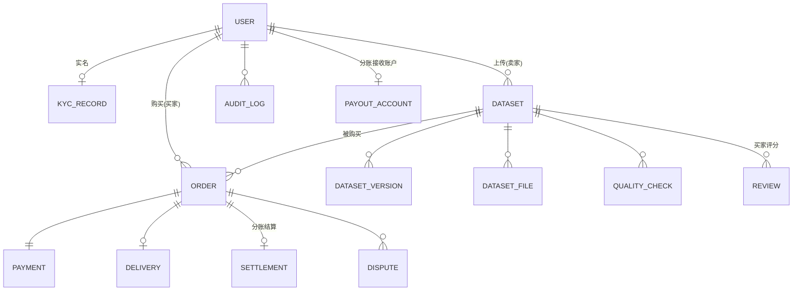

# AI 训练数据交易市场平台 — 完整设计与实施文档
**版本**：v2.0（整合 + 修正版）
**日期**：2026-05-31
**范围**：整体架构 + P3 MVP 全量落地（数据模型、接口、状态机、合规方案、技术验证、PR 计划）
**定位**：本文件可直接发给团队作为开发依据，也可作为对外说明的技术蓝本。

---

## 0. 本版相对初稿的关键修正（先读这一节）

初稿（设计文档 + Step2/3/4）整体方向正确，但有 **4 个会直接决定项目生死的问题**，本版全部修正：

| # | 初稿做法 | 问题 | 本版修正 |
|---|----------|------|----------|
| 1 | **资金托管**：买家付款进平台账户，确认后再结算给卖家 | **二清红线**。无支付牌照归集并二次分配用户资金，违反《非银行支付机构监督管理条例》，可构成非法经营罪。这是上线即违法 | 改为**分账模式**（微信/支付宝服务商分账 + 持牌聚合机构）。资金全程由持牌机构存管，平台不碰资金，靠分账指令实现"确认后结算" |
| 2 | 数据交付靠"临时链接 + 水印防二次传播" | **纯文本/代码无法做有效水印**，下载即可无限复制。把"防复制"当核心卖点是自欺 | 承认复制不可阻止，改用**组合策略**：样本预览限流 + 交付指纹溯源（弱约束）+ 法律协议（主约束）+ API/沙箱交付（P1 主防线）。定价随之重构 |
| 3 | 应用层拆 7 个微服务 | 4–6 人团队做微服务 = 自杀。分布式事务、服务发现、跨服务一致性会吃掉 80% 精力 | 改为**模块化单体**（单可部署单元 + 清晰模块边界），需要时再拆服务 |
| 4 | 搜索用 `PostgreSQL + pg_trgm` | `pg_trgm` 是三元组匹配，对**无词边界的中文几乎无效** | 改为 PostgreSQL 全文检索 + 中文分词（`zhparser` / `pg_jieba`），P2 再上 ES + IK |

> 后文凡涉及这 4 点，均按修正后的方案展开。

---

## 1. 背景与核心问题

- 公开 + 商业训练数据接近枯竭，高质量、干净、许可清晰的数据极度稀缺。
- 存量数据污染严重（噪声、重复、错误标注、版权问题、合成数据回流污染）。
- 数据持有者（专家、公司、研究机构、个人）缺乏合规变现渠道；训练方持续饥渴。

**平台价值**：建立**高信任、可追溯、合规**的数据流通基础设施，让优质数据被公平定价、安全交易、全程留痕。

**平台的真正护城河不是"撮合"，而是三件事**：
1. **质量可信**（买家敢为干净数据付溢价）；
2. **来源合规**（买家拿到的数据敢用于训练、不踩法律雷）；
3. **资金安全**（钱货两清、纠纷可裁决）。

撮合本身门槛极低，上面三点才是别人抄不走的东西。

---

## 2. 三条项目生死线（动工前必须认清）

这一节是本文档最重要的部分。技术做得再漂亮，这三条任何一条踩了都会让平台直接出局。

### 2.1 资金合规：托管即二清，必须走分账

**问题本质**：没有《支付业务许可证》的平台，把买家的钱收进自己账户再分给卖家 —— 这叫**资金二清**，是刑事风险（非法经营罪），不是"合规瑕疵"。即使资金放在第三方支付账户，但若资金进出由平台账户控制、平台对资金有实际处置权，也可能落入"资金二清"。

**正确解法：分账（账期 / 担保交易能力）**

利用微信支付 / 支付宝官方的**分账能力**，核心特征：
- 资金由**持牌机构（财付通 / 支付宝）直接存管**，不进平台自有账户；
- 交易成功后，待分账资金**冻结**在收款商户号中（最长冻结期约 180 天，超时自动解冻）；
- 买家确认收货后，平台发起**分账指令**，持牌机构按约定比例把卖家应得部分划给卖家、把佣金划给平台；
- 全程平台不经手资金，只下发指令 → 规避资金二清。

**两种落地形态，P3 建议先用前者：**

| 形态 | 适用 | 说明 | P3 建议 |
|------|------|------|---------|
| **平台普通商户 + 分账接收方** | 个人卖家为主、轻量 | 平台是收款商户，卖家（个人/企业）作为"分账接收方"。资金冻结在平台商户号（由财付通存管），确认后分账给卖家 + 平台佣金 | ✅ 先用这个 |
| **服务商收付通 + 二级商户** | 企业卖家、需要独立商户账期 | 卖家进件成"二级商户"，资金冻结在二级商户号，平台发分账指令抽佣 | P2 升级 |

**仍需警惕"信息二清"**：即使资金不进平台账户，若平台对资金有过度处置权、规则不透明，仍有合规风险。缓解措施：
- 分账规则**事前约定 + 电子签约**，对买卖双方透明；
- 分账接收方与卖家实名信息做**一致性校验**，并合法获得用户授权；
- 全部分账记录可追溯、可审计、可向监管导出。

**强烈建议**：P3 阶段直接接入一家**持牌聚合支付/分账服务商**（如汇付天下、连连、易宝、合宝、Ping++ 类）的担保交易/分账产品，由其承担清结算合规，平台只做业务编排。这比自己硬啃微信服务商资质快得多，也安全得多。**支付与资金流必须有法务 + 持牌方介入，不要让工程师自行决定。**

> ⚠️ 行动项：在写任何支付代码之前，先完成 **Spike-2（见第 8 节）**，与持牌方确认分账/担保产品的可行性、费率、个人卖家结算路径、退款与分账回退流程。

### 2.2 数据合规：来源合法性是平台命门

中国对 AI 训练数据的监管已成体系（《数据安全法》《个人信息保护法》《网络安全法》《生成式人工智能服务管理暂行办法》《互联网信息服务深度合成管理规定》等）。监管主线是：**训练数据来源合法、最小必要、个人信息去标识化、全链路可核验**。

**平台必须承担的责任（P3 即落地）：**
1. **上传强制声明**：卖家上传时必须声明数据来源、采集方式、是否含个人信息、许可范围（商业/研究/仅训练），并电子签署《数据来源合法性与授权承诺书》。
2. **形式审查 + 留痕**：平台对来源声明、许可类型做形式审查（人工 + 规则），所有审查动作进审计日志。无法做到"实质审查每条数据"，但**必须能证明自己尽到了形式审查义务**。
3. **个人信息检测**：上传后自动扫描常见 PII（身份证号、手机号、邮箱、银行卡、地址等），命中即标红、要求卖家去标识化或下架。
4. **侵权快速响应**：提供投诉入口 + 48 小时内下架机制（"通知-删除"避风港）。
5. **数据分级**：禁止上传国家核心数据、重要数据、未脱敏的敏感个人信息；对跨境交易（境外买家）单独走出境合规评估（P3 可先**禁止跨境**，只做境内）。

> P3 范围收敛：**仅做境内交易、仅做中文文本 + 代码 + 结构化数据（JSON/CSV）**。图像/视频/跨境留到 P1。这样能把合规面积压到最小。

### 2.3 数据交付：纯文本无法防复制，定价与交付要重构

**残酷事实**：纯文本、代码、JSON/CSV 一旦下载就能无限复制；对纯文本做"水印"基本无效（删两行就没了）。把"防二次传播"当核心能力是错的。

**正确策略（按防护强度排序）：**

| 手段 | 强度 | P3 做法 |
|------|------|---------|
| **法律协议**（主约束） | 强 | 下载前强制签署许可协议，明确禁止转售/再分发，违约可追责 |
| **交付指纹溯源**（弱约束） | 弱 | 每次交付生成"买家+订单"盐值哈希并记录；对结构化数据可注入极少量可识别"金丝雀样本"，泄露后比对溯源（仅威慑，非阻止） |
| **预览限流**（防白嫖） | 中 | 样本预览服务端随机抽样、上限严格（如 ≤100 条或 ≤0.1%）、脱敏、限频 |
| **临时下载链接** | 中 | 预签名 URL：短时效（如 15 分钟）、一次性、绑定订单、下载即审计 |
| **API / 沙箱交付**（P1 主防线） | 最强 | 数据不出平台，买家在平台内调用/采样/训练，从根上防复制 |

**对定价的影响**：既然全量复制不可阻止，定价应弱化"按份卖断"、强化：
- **按价值定价**（数据稀缺度、清洗成本、领域价值）；
- **订阅/增量**（持续更新的数据才有持续付费动力，P1）；
- **API 调用计费**（P1，配合沙箱）。

P3 仍以"一次性买断 + 平台建议价 + 卖家可调"为主，但产品文案不要承诺"防盗版"，而要承诺"**正版、干净、可追责、出问题平台担保**"。

---

## 3. 整体架构（修正版：模块化单体）

### 3.1 架构图



### 3.2 为什么是模块化单体而不是微服务

- 4–6 人团队，P3 数据量和并发都不大，微服务的分布式复杂度纯属负债。
- 模块化单体 = **一个可部署单元 + 内部清晰模块边界**（Go 用包隔离 + 接口约束，模块间只走定义好的接口，不直接摸对方的表）。
- 好处：本地事务保证一致性、部署运维极简、调试简单。
- 演进：当某模块（如质检、搜索）出现独立扩展需求时，沿既有边界**抽成独立服务**即可，前期边界画好就不会重写。

### 3.3 核心设计原则

1. **数据与元数据分离**：原始数据走对象存储，结构化信息走 PostgreSQL。
2. **异步优先**：大文件合并、质检、分账重试、通知全部进队列。
3. **全链路可追溯**：上传、审核、交易、分账、下载都进审计日志（合规要求，不是可选项）。
4. **资金不落平台账户**：所有资金流走持牌方，平台只下指令（见 2.1）。
5. **幂等优先**：支付回调、分账、结算等关键写操作必须幂等。

---

## 4. 核心交易流程（修正版，含分账）



**关键点**：
- 资金从 `paid` 到 `settled` **始终在持牌方处冻结/划转**，平台账户从不持有。
- 退款发生在分账前 → 原路退款；发生在分账后 → 走"分账回退"。
- 买家长期不确认 → 设置自动确认期（如 7 天），到期视为确认，触发分账（与冻结期 180 天上限对齐，留足缓冲）。

---

## 5. P3 MVP 范围与数据模型

### 5.1 P3 范围（已收敛）

| 维度 | 范围 |
|------|------|
| 数据类型 | 中文文本（.txt/.md）+ 代码 + 结构化（.json/.csv） |
| 交易地域 | **仅境内**（不做跨境，规避数据出境合规） |
| 支付 | 先打通**一个渠道**（建议微信），分账走持牌方；支付宝/Stripe 放 Phase 4 |
| 质检 | 基础版：格式校验 + 编码检测 + 简单统计 + 去重(MinHash) + PII 扫描 |
| 交付 | 临时链接 + 交付指纹 + 法律协议（不承诺防复制） |
| 多模态 | ❌ 不做 |

**P3 验收标准（一句话闭环）**：一个实名卖家能上传一个干净的中文数据集 → 通过质检与审核上架 → 买家能搜到、能预览、能下单支付 → 拿到下载链接并下载 → 确认后平台自动分账给卖家、抽 10% 佣金，全程留痕。

### 5.2 ER 图



### 5.3 关键表字段（P3 简化但够用）

> 金额统一用**整数分（int64）**存储，禁止浮点。时间统一 UTC。

**user**
`id(uuid) | account(phone/email) | password_hash | role(buyer/seller/both/ops/admin) | kyc_status(none/pending/verified/rejected) | status(active/frozen) | created_at | updated_at`

**kyc_record**
`id | user_id | type(personal/company) | real_name/company_name | id_no_hash(脱敏存储) | material_urls(jsonb) | verify_status | verify_provider | reviewed_by | reviewed_at | created_at`

**payout_account**（分账接收账户，合规关键）
`id | user_id | channel(wechat/alipay) | account_ref(渠道分账接收方ID) | name_consistency_checked(bool) | authorized_at | status | created_at`

**dataset**
`id | seller_id | title | description | data_type(text/code/structured) | domain(tag) | license_type(commercial/research/train_only) | suggested_price_cents | final_price_cents | status(draft/uploading/checking/reviewing/published/rejected/delisted) | total_size_bytes | sample_count | source_declaration(jsonb) | source_signed_at | current_version_id | created_at | updated_at`

**dataset_version**
`id | dataset_id | version_no | manifest(jsonb 文件清单) | content_sha256(整体内容指纹) | simhash(近重复指纹) | changelog | created_at`

**dataset_file**
`id | dataset_id | version_id | object_key | size_bytes | sha256 | content_type | created_at`

**quality_check**
`id | dataset_id | version_id | type(format/stats/dedup/pii) | result(pass/warn/fail) | report(jsonb) | created_at`

**order**
`id | buyer_id | seller_id | dataset_id | version_id | license_type | amount_cents | platform_fee_cents(=amount*10%) | seller_amount_cents | status | auto_confirm_at | created_at | updated_at`
> 唯一约束建议：`(buyer_id, dataset_id, status in 活跃态)` 防重复下单。

**payment**
`id | order_id(唯一) | channel(wechat/alipay/stripe) | channel_txn_id(唯一) | amount_cents | status(created/paid/refunded/refunding) | escrow_state(frozen/released/reverted) | idempotency_key(唯一) | paid_at | raw_callback(jsonb) | created_at`

**delivery**
`id | order_id(唯一) | download_token_hash | expires_at | max_downloads | download_count | delivery_fingerprint | last_download_ip | created_at`

**settlement**（分账结算流水）
`id | order_id(唯一) | split_txn_id(渠道分账单号, 唯一) | platform_fee_cents | seller_amount_cents | status(pending/success/failed/reverted) | idempotency_key | executed_at | created_at`

**dispute**
`id | order_id | raised_by | reason | status(open/reviewing/resolved_refund/resolved_release) | resolution_note | handled_by | created_at | resolved_at`

**review**
`id | order_id(唯一) | dataset_id | buyer_id | score(1-5) | comment | issue_flag(bool) | created_at`

**audit_log**
`id | actor_id | actor_role | action | resource_type | resource_id | ip | user_agent | detail(jsonb) | created_at`
> 审计日志只追加、不可改、不可删（合规要求）。

### 5.4 订单状态机（严格定义）

```
created ──(支付成功回调)──> paid(资金冻结)
paid ──(生成交付资格)──> delivered
delivered ──(买家确认 / 到期自动确认)──> confirmed
confirmed ──(分账成功)──> settled        [终态-正常]
任意活跃态 ──(发起纠纷)──> disputed
disputed ──(裁决:退款)──> refunded        [终态-退款]
disputed ──(裁决:放行)──> confirmed → settled
created ──(超时未支付)──> cancelled       [终态]
```

**转移规则**：
- 只有支付回调能驱动 `created→paid`，且必须幂等（按 `channel_txn_id` 去重）。
- `confirmed→settled` 必须加分布式锁 + 幂等键，防止并发/重试导致重复分账。
- 状态转移全部走统一的状态机函数，禁止散落各处直接 `UPDATE status`。
- 每次转移写 audit_log。

---

## 6. 模块详解：用户故事 + 接口

> 接口风格：REST，前缀 `/api/v1`，鉴权用 `Authorization: Bearer <JWT>`。
> 统一响应：`{ "code": 0, "message": "ok", "data": {...}, "request_id": "..." }`，非 0 为错误码。
> 所有写接口支持 `Idempotency-Key` 头。

### 6.1 用户与实名认证

**用户故事**
- US-1.1 访客可用手机号/邮箱 + 密码注册。
- US-1.2 用户可登录，返回 JWT + Refresh Token。
- US-1.3 用户可完善个人/企业资料。
- US-1.4 用户必须完成实名认证才能**发布或购买**（合规硬要求）。
- US-1.5 用户可同时是卖家和买家。
- US-1.6 运营可查看用户列表并做基础管理（冻结/解冻）。

**接口**

| 方法 | 路径 | 说明 | 权限 |
|------|------|------|------|
| POST | /auth/register | 注册 | 公开 |
| POST | /auth/login | 登录，返回 access+refresh token | 公开 |
| POST | /auth/refresh | 刷新 token | 公开(带refresh) |
| GET  | /users/me | 当前用户信息 | 登录 |
| PUT  | /users/me | 更新资料 | 登录 |
| POST | /users/me/kyc | 提交实名材料 | 登录 |
| GET  | /users/me/kyc | 查询实名状态 | 登录 |
| POST | /users/me/payout-account | 绑定分账接收账户(一致性校验+授权) | 卖家(已实名) |
| GET  | /admin/users | 用户列表 | 运营 |
| POST | /admin/users/{id}/freeze | 冻结/解冻 | 运营 |

请求示例：

```json
// POST /auth/register
{ "account": "138xxxx8888", "account_type": "phone", "password": "<明文,HTTPS传输,服务端bcrypt>" }
// POST /users/me/kyc
{ "type": "personal", "real_name": "张三", "id_no": "<服务端加密存储>", "material_urls": ["oss://..."] }
```

### 6.2 数据集与上传

**用户故事**
- US-2.1 卖家创建数据集草稿（名称、描述、领域、数据类型、许可、样本量估算、建议价）。
- US-2.2 卖家可分片上传大文件（断点续传）。
- US-2.3 上传完成后自动触发基础质检 + PII 扫描。
- US-2.4 卖家可在审核通过前修改元数据。
- US-2.5 卖家上传时必须电子签署来源合法性承诺。
- US-2.6 运营审核数据集（通过/拒绝 + 备注）。

**接口**

| 方法 | 路径 | 说明 | 权限 |
|------|------|------|------|
| POST | /datasets | 创建草稿(含来源声明) | 卖家(已实名) |
| PUT  | /datasets/{id} | 更新元数据(审核前) | 卖家(本人) |
| POST | /datasets/{id}/source-declaration/sign | 电子签署来源承诺 | 卖家 |
| POST | /datasets/{id}/upload/init | 初始化分片上传，返回 upload_id + 分片建议 | 卖家 |
| PUT  | /datasets/{id}/upload/part | 上传单个分片(part_number) | 卖家 |
| POST | /datasets/{id}/upload/complete | 完成上传，触发合并+质检 | 卖家 |
| GET  | /datasets/{id}/upload/status | 上传/质检进度 | 卖家 |
| GET  | /datasets/{id} | 详情 | 公开/登录 |
| POST | /admin/datasets/{id}/review | 审核 | 运营 |

分片上传流程：`init`（拿 upload_id 与分片大小）→ 多次 `part`（可并发、可重传单片）→ `complete`（服务端校验各片 sha256 后合并，计算整体 content_sha256 + simhash，入队质检）。

> 实现建议：直接用对象存储的**分片上传 SDK**（OSS/COS 原生支持 multipart + 断点续传），前端拿预签名分片 URL 直传，**绕开应用服务器**，避免大流量打穿后端。

### 6.3 质量检测（基础版编排）

**用户故事**
- US-3.1 系统对上传内容做格式校验、编码检测、基础统计。
- US-3.2 系统做去重检测（文件内 + 跨数据集近重复）。
- US-3.3 系统扫描常见 PII 并标红。
- US-3.4 检测结果回写数据集，作为审核与质量分依据。

**实现要点**
- **流式处理**：大文本/代码必须流式读取，禁止整文件加载进内存。
- **去重**：文件级 SHA256（精确）+ MinHash/SimHash（近重复），跨数据集比对可识别"倒卖他人数据/刷单重复上传"。
- **PII**：正则 + 词典扫身份证/手机号/邮箱/银行卡/地址，命中产出报告。
- **异步**：质检全部在 Worker 跑，结果写 `quality_check`，完成后推进数据集状态 `checking→reviewing`。

### 6.4 浏览与搜索

**用户故事**
- US-4.1 买家浏览已上架数据集列表（分页、排序）。
- US-4.2 买家按领域/数据类型/价格区间/质量分筛选。
- US-4.3 买家关键词搜索（中文分词）。
- US-4.4 买家查看详情页（描述、样本预览、许可、卖家信誉、评分）。

**接口**

| 方法 | 路径 | 说明 | 权限 |
|------|------|------|------|
| GET | /datasets | 列表 + 筛选 + 搜索 + 排序 + 分页 | 公开 |
| GET | /datasets/{id} | 详情 | 公开 |
| GET | /datasets/{id}/preview | 样本预览(服务端抽样+脱敏+限流) | 登录 |

**搜索实现**：PostgreSQL `tsvector` + 中文分词扩展（`zhparser` 或 `pg_jieba`），对 title/description/tags 建全文索引。**不要用 pg_trgm 做中文**。数据量上千后再迁 ES + IK analyzer。

### 6.5 订单与状态机

**用户故事**
- US-5.1 买家对数据集发起购买（选许可、确认价格）。
- US-5.2 买家可见建议价；议价 P3 简化为"卖家最终定价，买家接受"。
- US-5.3 买家查看自己的订单与状态。
- US-5.4 卖家查看收到的订单。
- US-5.5 系统完整记录状态流转（见 5.4）。

**接口**

| 方法 | 路径 | 说明 | 权限 |
|------|------|------|------|
| POST | /orders | 创建订单 | 买家(已实名) |
| GET  | /orders | 我的订单列表 | 登录 |
| GET  | /orders/{id} | 订单详情 | 订单相关方 |
| POST | /orders/{id}/confirm-delivery | 确认收货(触发分账) | 买家 |
| POST | /orders/{id}/dispute | 发起纠纷 | 买卖双方 |
| POST | /admin/orders/{id}/resolve | 裁决纠纷 | 运营 |

### 6.6 支付与分账（重点，见 2.1）

**用户故事**
- US-6.1 买家用微信（P3）支付订单。
- US-6.2 支付成功后资金冻结在持牌方，不进平台账户。
- US-6.3 买家确认后，平台发起分账：卖家得 90%，平台得 10%。
- US-6.4 卖家可查看收益与可提现金额。
- US-6.5 运营可查看交易流水与佣金统计。

**接口**

| 方法 | 路径 | 说明 | 权限 |
|------|------|------|------|
| POST | /payments/create | 创建支付单(打分账标识)，返回二维码/链接 | 买家 |
| POST | /payments/webhook/{channel} | 支付渠道回调(幂等) | 渠道(验签) |
| POST | /orders/{id}/settle | 触发分账结算(内部, 确认后调用) | 系统/运营 |
| GET  | /sellers/me/earnings | 卖家收益与可提现 | 卖家 |
| GET  | /admin/transactions | 交易流水 + 佣金统计 | 运营 |

**资金流（P3）**：

```
买家支付 → 资金冻结(持牌方, 非平台账户)
          → 买家确认/自动确认
          → 平台发起分账指令
          → 持牌方划付: 卖家90% + 平台佣金10%
          → settlement 流水落库
```

**工程红线**：
- 回调**幂等**：按 `channel_txn_id` + 唯一约束去重，重复回调直接返回成功。
- 回调**验签**：必须校验渠道签名，拒绝伪造。
- 分账**加锁 + 幂等键**：`confirmed→settled` 用 Redis 锁（或 PG advisory lock）+ `settlement.idempotency_key` 唯一，杜绝重复分账。
- **可靠事件**：用 outbox 模式把"分账任务"落库再投递队列，失败可重试。
- 退款/分账回退场景必须在 Spike-2 与持牌方确认清楚再写代码。

### 6.7 数据交付（见 2.3）

**用户故事**
- US-7.1 支付成功后买家获取一次性短时效下载链接。
- US-7.2 下载记录交付指纹（订单+买家），用于事后溯源。
- US-7.3 卖家可查看自己的数据被哪些订单下载（基础审计）。

**接口**

| 方法 | 路径 | 说明 | 权限 |
|------|------|------|------|
| POST | /orders/{id}/download | 申请下载(签署许可协议后)，返回临时 token | 已支付买家 |
| GET  | /files/{token} | 实际下载(校验 token 时效/次数/IP) | 持有效 token |

**策略**：预签名 URL，时效 15 分钟、一次性、绑定订单与买家、下载即写审计。下载前强制勾选并签署《数据使用许可协议》。**不承诺防复制，只承诺可追责。**

### 6.8 权限 / 安全 / 审计 / 风控（横切）

- **鉴权**：JWT(access, 短) + Refresh Token(长, 可吊销)；密码 bcrypt/argon2。
- **RBAC**：角色 = 普通用户/卖家/买家/运营/管理员；用 Casbin 或轻量中间件。接口级权限中间件统一拦截。
- **限流**：登录、注册、预览、下载、支付接口按 IP + 用户双维度限流（Redis）。
- **审计**：上传、审核、交易、分账、下载、纠纷裁决全部入 `audit_log`（只追加）。
- **基础风控（P3 轻量）**：同一数据指纹重复上传告警、异常下单频率告警、PII 命中拦截、敏感操作二次确认。
- **隐私**：身份证号等敏感字段加密存储，日志脱敏，绝不进 URL 参数。

### 6.9 后台运营（P3 必须有）

- 数据集人工审核队列（通过/拒绝 + 备注）。
- KYC 材料审核。
- 纠纷订单处理与裁决。
- 交易流水 / 佣金 / 用户基础统计。
- 数据集投诉处理与快速下架。

> 实现：P3 嵌入主后端即可（同一服务、独立路由 `/admin/*` + 运营角色鉴权）。P2 再考虑独立后台。

---

## 7. 技术栈最终决策

| 层级 | 选型 | 理由 |
|------|------|------|
| 后端 | **Go + Gin/Fiber** | 并发好、大文件友好、部署简单、国内大模型公司后端主流 |
| 前端 | **Next.js 14 (App Router) + TS + Tailwind** | 开发快、列表页 SEO 友好 |
| 数据库 | **PostgreSQL 16 + Redis** | 事务可靠；Redis 做缓存/锁/限流 |
| 搜索 | **PostgreSQL FTS + 中文分词(zhparser/pg_jieba)** | P3 数据量小够用；**不用 pg_trgm 做中文** |
| 对象存储 | **阿里云 OSS / 腾讯云 COS** | 国内上传下载快，原生分片 + 预签名 |
| 任务队列 | **Asynq(基于 Redis)** | 轻量，适合上传后处理/质检/分账重试 |
| 支付/分账 | **持牌聚合方分账产品 + 微信支付(P3)** | 合规清结算外包给持牌方；支付宝/Stripe 放 Phase 4 |
| 部署 | **Docker Compose(初期) → 云托管** | MVP 别碰 K8s；用 ECS+RDS+OSS+SLS 一条龙 |
| 监控 | **Prometheus + Grafana + Sentry + 云日志(SLS)** | 必备 |
| 鉴权 | **JWT + Refresh + Casbin** | 简单可靠 |

**架构形态**：模块化单体（见第 3 节），不是微服务。

---

## 8. 必须先做的技术验证（Spike，正式开发前 2–4 周）

按风险排序，**前两个是命门**：

| # | 验证点 | 目标 | 关键问题 |
|---|--------|------|----------|
| **Spike-1** | 大文件分片上传 + 断点续传 | 5GB+ 稳定上传 | 前端直传 OSS、断点续传、完整性校验、弱网表现 |
| **Spike-2** | **分账/担保支付闭环（最高风险）** | 跑通"支付→冻结→确认→分账→佣金" | **与持牌方确认**：个人卖家结算路径、分账费率、退款与分账回退、冻结期、对账。**先确认可行再写代码** |
| Spike-3 | 基础质检 Pipeline | 跑通格式+统计+去重+PII | 流式处理、MinHash 跨集去重、结果回写 |
| Spike-4 | 安全交付 | 临时链接 + 指纹 + 防盗链 | 预签名时效/一次性、Referer 限制、下载审计 |
| Spike-5 | 实名认证对接 | 个人 + 企业实名 | 对接实人认证/营业执照 OCR 核验 |
| Spike-6 | 支付渠道抽象 | 易扩展新渠道 | Payment Gateway 抽象接口 |

> **如果 Spike-2 发现分账/担保在你的卖家结构（大量个人卖家）下走不通，整个商业模式要回炉**——所以它必须最先做、且拉法务和持牌方一起做。

---

## 9. 第一版 PR 计划（可独立评审合并）

按"依赖顺序 + 价值顺序"排列。每个 PR 控制在 1–2 个功能点。

### Phase 0 — 基础设施

| PR | 标题 | 内容 | 依赖 |
|----|------|------|------|
| PR-01 | 脚手架 + 基础架构 | Go 项目结构、Next.js、Docker Compose、CI | — |
| PR-02 | 数据库初始化 + 迁移 | 全部 P3 表 + 迁移工具(golang-migrate) | PR-01 |
| PR-03 | 统一响应/错误码/日志/中间件 | 标准响应、全局错误、请求日志、request_id | PR-01 |

### Phase 1 — 用户地基

| PR | 标题 | 内容 | 依赖 |
|----|------|------|------|
| PR-04 | 注册登录 + JWT | 注册、登录、Refresh、JWT 中间件 | PR-02,03 |
| PR-05 | 资料 + 实名(对接Spike-5) | 资料编辑 + KYC 提交/查询 | PR-04 |
| PR-06 | RBAC 权限 | 角色 + Casbin/中间件 + 限流 | PR-04 |

### Phase 2 — 数据集核心

| PR | 标题 | 内容 | 依赖 |
|----|------|------|------|
| PR-07 | 数据集元数据 CRUD + 来源签约 | 创建/编辑/详情/列表 + 来源承诺电子签 | PR-05 |
| PR-08 | 分片上传 + 断点续传(对接Spike-1) | init/part/complete/status + 直传OSS | PR-07 |
| PR-09 | 基础质检任务(对接Spike-3) | 异步格式+统计+去重+PII，结果回写 | PR-08 |
| PR-10 | 后台审核流程 | 审核接口 + 状态机 + 通知 | PR-09 |

### Phase 3 — 交易闭环

| PR | 标题 | 内容 | 依赖 |
|----|------|------|------|
| PR-11 | 订单 + 状态机 | 创建订单 + 严格状态机(5.4) | PR-10 |
| PR-12 | 支付集成(微信, 对接Spike-2/6) | 支付创建 + 幂等验签回调 | PR-11 |
| PR-13 | **分账 + 结算** | 冻结→确认→分账抽佣 + 锁 + 幂等 + outbox | PR-12 |
| PR-14 | 交付(临时链接+指纹+许可签约) | 下载 token + 审计(对接Spike-4) | PR-13 |

### Phase 4 — 完善与打磨（可上线）

| PR | 标题 | 内容 | 依赖 |
|----|------|------|------|
| PR-15 | 多支付渠道 | 支付宝 + Stripe | PR-13 |
| PR-16 | 搜索与筛选 | 中文分词全文检索 + 筛选 | PR-10 |
| PR-17 | 卖家收益中心 | 收益统计 + 可提现 | PR-13 |
| PR-18 | 评分/纠纷/审计/风控 | 评分、纠纷裁决、审计、基础风控 | 全量 |

**开发顺序建议**：PR-01~03 → 并行启动 Spike-1/2 → PR-04~06 → 重头 PR-07~14 → PR-15~18。

---

## 10. 团队、节奏、里程碑

**团队（4–6 人）**：1 后端(Go, 主力) + 1 前端(Next.js) + 1 全栈/后端(支付+质检) + 1 产品/运营(审核+内容) + 0.5 外包/顾问(支付分账+资金合规) + 0.5 法务(数据+资金合规, 关键)。

**最需要外部专家的两块**：① 支付分账与资金合规；② 数据来源/个人信息合规。这两块不要省。

**节奏**：
- **第 0 阶段(2–4 周)**：完成 Spike-1/2/3 + 敲定持牌方 + 法务出合规框架。
- **第 1 阶段(核心开发)**：按 PR 顺序推进，PR-07~14 是最花时间的核心。
- **第 2 阶段(上线)**：云托管一条龙（ECS+RDS+OSS+SLS），不碰 K8s。

**里程碑判据**：
- M1：用户能注册、实名、登录（PR-04~06）。
- M2：卖家能上传 + 过质检 + 过审核（PR-07~10）。
- M3：买家能下单 + 支付 + 拿数据（PR-11~12,14）。
- M4：**确认后自动分账抽佣跑通**（PR-13）—— 这是商业闭环达成点。
- M5：可灰度上线（PR-15~18）。

---

## 11. 风险登记册

| 风险 | 等级 | 影响 | 应对 |
|------|------|------|------|
| 资金二清 | **极高** | 刑事/平台关停 | 分账模式 + 持牌方 + 法务介入(2.1, Spike-2) |
| 数据来源/个人信息违规 | **极高** | 行政处罚/下架 | 来源签约 + 形式审查 + PII 扫描 + 仅境内(2.2) |
| 个人卖家分账走不通 | 高 | 商业模式受限 | Spike-2 优先验证；走分账接收方个人账户路径 |
| 数据下载后无限复制 | 高 | 卖家不敢上架 | 法律协议为主 + 指纹溯源 + API/沙箱(P1)(2.3) |
| 大文件上传不稳 | 高 | 卖家流失 | 直传 OSS + 断点续传(Spike-1) |
| 支付回调重复/丢失 | 中 | 资金错乱 | 幂等 + 验签 + outbox + 对账(6.6) |
| 重复/倒卖数据刷单 | 中 | 平台质量崩坏 | 跨集指纹去重 + 风控告警(6.3,6.8) |
| 微服务过度设计 | 中 | 团队效率崩 | 模块化单体(第3节) |

---

## 12. 开放问题与建议决策

| # | 问题 | 建议默认决策(可推翻) |
|---|------|----------------------|
| 1 | P3 优先哪些中文子领域？ | 先做**中文互联网通用文本 + 开源代码语料**两类，样本好找、合规相对清晰 |
| 2 | 建议价怎么算？ | P3 用**简单公式**：基础价(按 MB/样本数分档) × 领域系数 × 质量分系数；卖家可在 ±50% 内调 |
| 3 | 存储成本谁承担？ | P3 平台承担（量小），上架成功才计费；P2 引入卖家分担/上架押金 |
| 4 | 版权审核责任边界？ | **形式审查 + 通知删除避风港**，上传强制声明 + 投诉 48h 下架；不做实质逐条审查（也做不到） |
| 5 | 是否做跨境交易？ | **P3 不做**，仅境内，规避数据出境合规；P1 再评估 |
| 6 | 议价机制？ | P3 简化为"卖家定价、买家接受"，不做实时议价 |

---

## 附：文档使用说明

- 本文件可直接作为团队开发依据、工时评估输入、第一版接口契约基础。
- **动工前置条件（缺一不可）**：完成 Spike-2（分账可行性）+ 法务出具数据/资金合规框架。
- 上线前再单独补：《数据来源合法性承诺书》《数据使用许可协议》《平台服务协议与免责声明》三份法律文本（建议法务起草，不要工程师写）。
