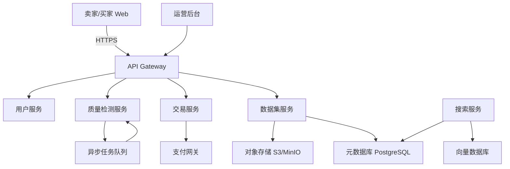
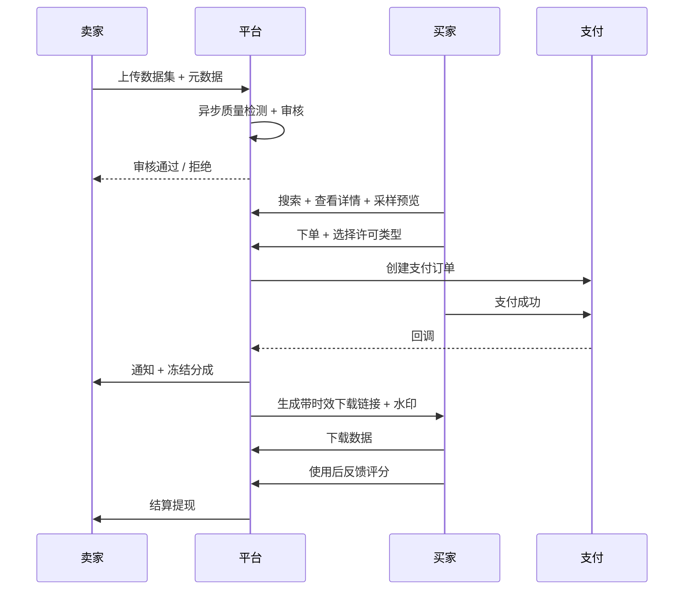

# Verdant Oasis（绿洲）
> AI 训练数据交易市场 · *In the data desert, we build a pure oasis. / 在数据荒漠中，我们筑起一片纯净绿洲。*

## 设计文档（简化版 v1.0）

**目标**：打造一个像“淘宝/亚马逊”一样的高质量AI训练数据自由交易平台，让个人、公司、机构能方便、安全地买卖干净、可验证的训练数据，解决当前大模型训练数据枯竭 + 严重污染的问题。

**文档范围**：仅覆盖整体架构 + 核心功能模块（按先P3再P2再P1优先级拆解）。不涉及详细接口、数据库Schema、UI设计、法律合规细则。

**日期**：2026-05-31  
**状态**：初稿（供讨论与拆任务用）

---

## 1. 背景与核心问题

- 当前公开 + 商业训练数据已接近枯竭。
- 现有数据污染严重（噪声、重复、错误标注、版权问题、合成数据污染等，用户称为“呼吸污染”）。
- 真正高质量、干净、有明确许可的数据极度稀缺。
- 数据持有者（专家、公司、研究机构、个人）缺乏变现渠道。
- AI训练方（大模型公司、创业团队、研究机构）持续饥渴。

**平台价值**：建立高信任的数据流通基础设施，让优质数据能被公平定价、交易、追踪。

---

## 2. 平台整体架构（高层次）

```
用户层
├── Web 端（卖家上传/买家搜索购买）
├── 管理后台（运营、审核）
└── 可能的 API / SDK（后期）

应用服务层（核心）
├── 用户与认证服务
├── 数据集管理服务（元数据、版本、上传）
├── 质量检测服务（自动化 + 人工）
├── 交易与订单服务
├── 支付与分成服务
├── 搜索与推荐服务
└── 信誉与风控服务

数据与存储层
├── 元数据：PostgreSQL
├── 对象存储：S3 / MinIO / 阿里云OSS（原始数据、处理后数据）
├── 向量/索引：Elasticsearch / Milvus（用于语义搜索）
├── 消息队列：Kafka / RabbitMQ（异步处理）
└── 缓存：Redis

基础设施
├── 容器编排：Kubernetes
├── 监控：Prometheus + Grafana + 日志
├── 鉴权：OAuth2 + JWT
└── 合规：数据脱敏、审计日志、权限控制
```

**Mermaid 架构图**



**核心设计原则**：
- 数据与元数据分离（原始数据走对象存储，结构化信息走数据库）。
- 异步优先（大文件上传、质量检测、格式转换全部异步）。
- 一切可追溯（上传、处理、交易、下载全链路审计日志）。

---

## 3. 核心功能模块（按先P3 → P2 → P1）

### P3 - 最高优先级（MVP 必须先做，目标：能跑通最小交易闭环）

| 模块 | 核心功能 | 为什么是P3 |
|------|----------|------------|
| **用户体系** | 注册、登录、实名认证（个人/企业）、角色区分（卖家/买家/双方） | 所有交易基础 |
| **数据集上传** | 大文件分片上传、断点续传、元数据填写（名称、描述、领域、模态、样本量、许可类型） | 没有数据就没有市场 |
| **数据集浏览与搜索** | 基础列表、按领域/模态/价格/质量筛选、简单关键词搜索 | 买家能找到东西 |
| **交易与订单** | 创建订单、定价（平台建议价 + 卖家可调整，支持一次性买断 / 按样本量等）、订单状态流转 | 能完成钱与货的交换 |
| **数据交付** | 订单支付后生成临时下载链接（带时效 + 水印或加密） | 买家拿到数据 |
| **支付与分成** | 对接微信支付 + 支付宝 + 国际支付，**资金托管模式**（参考闲鱼：买家支付后平台托管，确认后结算给卖家），平台佣金 10% + 卖家提现 | 闭环商业 + 资金安全 |
| **基础权限与安全** | 登录态、上传权限、下载鉴权 | 不能出安全问题 |

**P3 目标**：一个普通卖家能上传一个干净数据集 → 买家能搜索到 → 下单支付 → 下载数据。整个流程可跑通。

**P3 数据类型范围**：优先支持**中文文本**（txt、md 等）和**代码数据**，同时支持结构化数据（JSON、CSV）。图像、视频等多模态数据暂不在 P3 范围内。

### P2 - 第二优先级（建立信任与质量护城河）

| 模块 | 核心功能 | 价值 |
|------|----------|------|
| **自动化质量检测** | P3 先做基础版（格式校验、简单统计、基础去重）；P2 再扩展重复检测、毒性过滤、分布分析等更强能力 | 降低买家风险，P3 控制复杂度 |
| **人工审核 + 买家反馈闭环** | 运营审核队列、买家对数据集打分 + 问题举报、质量分数计算 | 真正解决“呼吸污染” |
| **数据版本与溯源** | 数据集支持版本更新、变更历史、哈希校验、链上或数据库溯源记录 | 防止数据被偷偷污染 |
| **卖家信誉系统** | 上传历史、完成交易数、买家评分、违规记录 | 买家敢下单 |
| **许可与使用追踪** | 明确许可类型（商业/研究/仅训练）、下载水印、基础使用报告 | 法律与合规基础 |

**P2 目标**：买家敢为“高质量”付溢价，平台开始建立数据质量品牌。

### P1 - 第三优先级（规模化与差异化竞争力）

| 模块 | 核心功能 | 价值 |
|------|----------|------|
| **高级搜索与推荐** | 语义搜索（向量）、按任务类型推荐、质量-价格排序模型 | 大幅提升匹配效率 |
| **多模态与大规模支持** | 视频、音频、代码仓库、合成数据、超大文件（TB级）、增量上传 | 覆盖主流训练需求 |
| **企业级能力** | 企业账号、批量采购、API 访问、自定义水印、SLA、发票 | 吸引大客户 |
| **订阅与持续数据** | 数据集订阅制、新数据自动推送、增量更新 | 形成长期收入 |
| **数据沙箱 / 预览** | 买家在平台上小规模采样验证（不下载全量） | 降低购买决策成本 |
| **风控与反作弊** | 虚假数据检测、刷单识别、版权投诉处理 | 平台长期健康 |

---

## 4. 核心交易流程（简化）



---

## 5. 主要技术挑战 & 应对思路

| 挑战 | 严重程度 | 初步应对 |
|------|----------|----------|
| 大文件上传与存储成本 | 高 | 分片上传 + 按需存储 + 冷热分层（热数据 SSD，冷数据对象存储归档） |
| 数据质量验证规模化 | 高 | 自动化检测（80%）+ 众包/专家审核（20%）+ 买家反馈强化学习 |
| 版权与合规风险 | 极高 | 上传时强制许可声明 + 平台免责声明 + 侵权投诉快速下架机制 + 后期引入第三方版权验证 |
| 信任建立 | 高 | 初期重人工审核 + 透明质量分数 + 交易担保机制 |
| 支付与资金安全 | 中 | 微信+支付宝+国际支付 + 资金托管模式（参考闲鱼，买家确认后才结算给卖家），平台抽成 10% |

---

## 6. 推荐技术栈（初期可落地版）

- **后端**：Go / Java（Spring Boot） 或 Node.js（TypeScript）—— 推荐 Go（性能 + 并发好）
- **前端**：Next.js / React + TypeScript
- **数据库**：PostgreSQL + Redis
- **对象存储**：MinIO（自建）或 阿里云OSS / AWS S3
- **搜索**：Elasticsearch（初期可先用 PostgreSQL + 简单索引，后期换）
- **任务队列**：Celery（Python）或 Asynq / RabbitMQ
- **容器**：Docker + Kubernetes（或先用 Docker Compose + 云服务）
- **监控**：Prometheus + Grafana + Sentry
- **支付**：微信支付 + 支付宝 + Stripe（国际）

**MVP 阶段建议**：先用云服务（阿里云/腾讯云/AWS）快速上线，降低运维压力。等规模上来再自建核心组件。

---

## 7. 阶段性实施路线图（严格先3再2再1）

**Phase 3（P3）- 3~6个月目标**：跑通最小闭环
- 用户注册 + 实名
- 数据集上传 + 基础元数据
- 简单搜索 + 列表
- 完整交易流程（下单-支付-下载）
- 基础订单管理
- 简单后台审核

**Phase 2（P2）- 6~12个月目标**：建立质量信任
- 自动化质量检测流水线
- 买家评分与反馈系统
- 数据版本管理
- 卖家信誉分
- 初步使用追踪

**Phase 1（P1）- 12个月以后**：规模化与竞争力
- 语义搜索 + 推荐
- 多模态与超大文件支持
- 企业功能 + API
- 订阅模式
- 高级风控

---

## 8. MVP 已确认关键决策（2026-05-31 更新）

根据用户确认，以下决策已固化，将作为后续拆解 P3 的依据：

- **垂直领域与数据类型（P3）**：优先聚焦**中文文本**和**代码数据**。P3 至少支持纯文本文件（.txt, .md 等）和结构化数据（JSON / CSV）。后期逐步扩展图像、视频等多模态。
- **P3 范围**：保持原设计范围，不再收窄。
- **定价模式**：采用“平台建议价 + 卖家可调整”模式。
- **平台佣金**：初期 10%。
- **支付与资金安全**：支持微信支付 + 支付宝 + 国际支付（Stripe 等）。采用**资金托管模式**（参考闲鱼）：买家支付后资金先由平台托管，买家确认收货/下载数据无误后再结算给卖家。
- **P3 质量验证**：采用方案 B —— 基础自动化检测（格式校验、简单统计、基础去重） + 人工审核。后期再升级更强的自动化质量分系统。
- **目标用户**：卖家和买家均无优先级限制，同时支持个人、专家、小团队、大公司、高校研究机构等。

**剩余开放问题**（后续讨论）：
1. 具体垂直领域内，P3 最优先支持哪些子领域（如中文互联网文本、法律文本、代码仓库类型等）？
2. 平台建议价的计算规则如何制定？（按 token 数？按 MB？按样本数量？）
3. 数据存储成本初期由平台承担还是卖家承担部分？
4. 平台对上传数据的版权审核责任边界如何定义（上传时声明 vs 平台主动审查）？

---

**下一步建议**：
1. 确认本文档范围是否满足当前讨论需要。
2. 针对 P3 模块进一步拆解成可执行的用户故事 / 接口列表。
3. 讨论技术选型最终决策。
4. 开始第一轮 PR / 任务拆分。

文档位置：`/Users/lei/ai-data-marketplace/docs/设计文档-整体架构与核心模块.md`

需要我现在基于这个文档，继续拆 P3 的详细模块、用户故事、或者画更细的流程图吗？随时说。