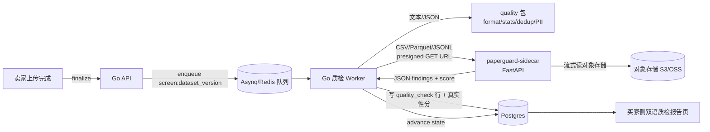

# 绿洲 · 质量筛查与数据真实性引擎设计文档
## （PaperGuard Sidecar 接入方案）

**日期**：2026-06-01
**状态**：初稿（设计待评审，先评审后编码）
**范围**：数据集质检流水线升级 —— 异步化、统计真实性筛查（接入 PaperGuard）、PII 脱敏强化、买家侧双语质检报告。**不涉及**支付、搜索、前端商品页改版。
**作者**：平台技术

> 设计原则继承 PaperGuard 的认知立场：**质检只产出"信号"，不产出"结论/造假判定"**。每条发现都带「无辜解释」+「方法引用」+「多重比较校正后的 p 值」。这与《用户服务协议》第 6 条（质检为自动化辅助、仅供买方参考，不构成合规或适用性保证）和第 12 条（免责）形成**法律—产品闭环**。

---

## 1. 背景与目标

绿洲品牌主张「纯净绿洲」——让干净、可验证的训练数据汇聚。当前质检（[backend/internal/modules/quality](../backend/internal/modules/quality)）只覆盖 **格式 / 基础统计 / 去重 / PII** 四类，且**内联在上传线程**里跑（[upload.go](../backend/internal/modules/dataset/upload.go)），存在三个缺口：

1. **没有"数据是否被编造/灌水/模板生成"的统计筛查** —— 这恰是 AI 训练数据买家最大的不信任点。
2. **质检同步阻塞上传**，大文件会拖垮请求；`quality/doc.go` 自己已规划"Production moves orchestration to an Asynq worker"，尚未落地。
3. **PII 只检测不闭环**：有 `MaskPII` 但没有"脱敏后二次校验"，无法证明脱敏后零残留。

**本设计目标**：

- G1：质检**异步化**（Asynq worker），支持大文件流式、可重试、可观测。
- G2：接入 **PaperGuard 数值表格取证子集**，为每个数据集产出 **0–100「数据真实性分」+ 分级标签**。
- G3：**强化 PII**（更多类型 + Luhn 校验降误报）+ 实现**脱敏后二次校验闭环**。
- G4：**买家侧双语质检报告**，复用 PaperGuard 的认知谦逊表达，强化"纯净"品牌与法律免责。

**非目标（明确不做）**：搬运 PaperGuard 的论文专用能力——statcheck p 值重算、图像取证、tortured-phrase 论文工厂指纹、引用图谱、撤稿/PubPeer 交叉核验、EXIF/rsid。这些与数据交易无关。

---

## 2. 现状与缺口对照

| 检查 | 现状（Go, 内联） | 升级后 |
|---|---|---|
| Format | UTF-8 / JSON / CSV 可解析 | + Parquet / JSONL / 多分隔符 CSV |
| Stats | 行数/字节/均长 | + 列级类型推断、缺失率、基数 |
| Dedup | SHA256 精确 + SimHash 近重 | 保留（行级去重列入二期） |
| PII | 5 类正则 + MaskPII | + 类型扩充 + Luhn + **脱敏后二次校验** |
| **真实性筛查** | **无** | **PaperGuard sidecar：末位数/Benford/GRIM 族/列间关系/哨兵值/平滑度** |
| 编排 | 上传线程内联 | **Asynq 异步 worker** |
| 评分 | 无（`score 1-5` 是用户评价，非数据质量） | **真实性分 0–100 + band** |

---

## 3. 总体架构（Sidecar 微服务）

PaperGuard 是成熟 Python 包（PyPI `paperguard`、41 检测器、616 测试、插件系统）。**不移植到 Go**，以 Sidecar 复用，几乎零改 PaperGuard 源码，可跟随上游升级。



**关键边界**：

- **Go worker 是编排者**：拉对象、跑 Go 原生检查、调 sidecar、聚合写库、推进状态机。**唯一**写 `quality_check` 与 dataset 状态的地方。
- **sidecar 是纯函数式无状态服务**：输入 presigned GET URL + 检测器选项，**自己流式读对象**（绝不让 Go 把整文件灌进内存或转发 body），输出 JSON。不连业务库、不持久化。
- 部署：sidecar 与 worker 同 VPC/内网，仅内网可达；docker-compose 加一个 service，K8s 加一个 Deployment + ClusterIP。

---

## 4. PaperGuard 检测器子集（映射到数据质量语义）

只启用**数值/表格取证**类，并把"论文造假信号"重述为"数据质量信号"。sidecar 配置白名单，其余检测器禁用。

| PaperGuard 检测器 | 方法引用 | 在绿洲的含义 | 命中提示（脱敏措辞） |
|---|---|---|---|
| 末位数字分布 | Mosimann 1995 / Geng 2025 | 数值列末位是否非均匀（手工编造/凑数特征） | 「末位数字分布偏离均匀，建议复核采集流程」 |
| Benford 首位 | Benford | 宽动态范围列首位是否偏离 Benford | 「首位数字分布异常，可能为生成或缩放数据」 |
| GRIM / GRIMMER | Brown & Heathers 2017 / Anaya 2016 | 报告的均值/方差在给定样本量下数学上是否可能 | 「均值与样本量不自洽」 |
| SPRITE | Heathers 2018 | 能否重构出与统计量一致的样本分布 | 「难以重构自洽样本」 |
| 列间算术关系 | —— | 列间恒定差/比（模板填充、派生列冒充原始） | 「检测到列间恒定关系，疑似派生/模板列」 |
| 哨兵/占位值 | —— | -999 / 9999 / 0 占位是否被当作真实值 | 「疑似占位/缺失哨兵值混入有效数据」 |
| 残差过度平滑 | Stapel 案 | 数据是否过于平滑（模板/插值生成） | 「数据平滑度异常，可能为合成/插值」 |
| 缺失模式 | Carlisle 思想 | 缺失是否呈非随机结构 | 「缺失呈非随机模式」 |

> 每条命中都强制附 ≥3 条 `innocent_explanations`（如"本就是整数计量""单位换算导致""仪器精度限制"），**报告永不出现"造假/欺诈/伪造"措辞**——沿用 PaperGuard 的 epistemic position。

**绿洲专属扩展（二期，用 PaperGuard 插件系统 `paperguard.detectors`，不改其核心）**：token/文本长度分布异常、类别极度不均、训练/测试疑似泄漏、标签与特征恒等（标签泄漏）。

---

## 5. 接口契约（Go worker ↔ sidecar）

### 5.1 `POST /v1/screen`

**Request**
```json
{
  "schema_version": "1.0",
  "dataset_version_id": "uuid",
  "object_url": "https://oss.internal/presigned-GET?...",
  "format": "csv | parquet | jsonl",
  "options": {
    "detectors": ["terminal_digit","benford","grim","grimmer","sprite",
                  "inter_column","sentinel","smoothness","missing_pattern"],
    "locale": "zh",
    "fdr_alpha": 0.05,
    "max_rows": 5000000,
    "max_seconds": 120
  }
}
```

**Response 200**
```json
{
  "schema_version": "1.0",
  "dataset_version_id": "uuid",
  "engine": { "paperguard_version": "2.17.0", "detectors_run": 9 },
  "summary": {
    "authenticity_score": 82,
    "band": "clean | review | suspect",
    "n_findings": 3,
    "columns_screened": 12,
    "rows_screened": 48000,
    "truncated": false
  },
  "findings": [
    {
      "detector": "terminal_digit",
      "detector_ref": "Mosimann 1995",
      "column": "yield_pct",
      "severity": "info | low | medium | high",
      "p_value": 0.0021,
      "p_value_adjusted": 0.0189,
      "statistic": { "chi2": 31.4, "df": 9 },
      "message_zh": "末位数字分布偏离均匀…",
      "message_en": "Terminal-digit distribution deviates from uniform…",
      "innocent_explanations": ["列为整数计量", "单位换算导致聚集", "仪器精度限制"]
    }
  ],
  "errors": []
}
```

**约定**

- 失败语义：sidecar 永不 5xx 业务失败，**部分失败**放 `errors[]`（如某列解析失败），整体仍返回已完成 findings → worker 写 `partial` 标记，不阻断上架。
- 真实超时/进程错误才 5xx → Asynq 重试（指数退避，上限 3 次）。
- 幂等：以 `dataset_version_id` + 内容哈希为键，重复调用结果稳定。
- 大文件：`max_rows`/`max_seconds` 截断 → `summary.truncated=true`，报告显式标注"抽样筛查"（**绝不静默截断**，沿用 PaperGuard 的"no silent caps"实践）。

### 5.2 `GET /healthz`
返回 `{ "status": "ok", "paperguard_version": "..." }`，worker 启动与存活探针用。

---

## 6. 数据真实性分（评分算法）

**信号非结论**：分数仅用于**标注与排序**，**绝不自动下架**。低分数据集仍可上架，但买家侧醒目标注 + 需卖家二次确认知情。

```
score = 100
对每条 p_value_adjusted < fdr_alpha 的 finding：
    score -= weight[severity]        # info:0  low:4  medium:10  high:20
score = clamp(score, 0, 100)

band: score>=85 → clean(纯净绿洲✅)   60–84 → review(建议复核)   <60 → suspect(显著异常)
```

- 仅对**FDR 校正后显著**的发现扣分（控制多重比较假阳性）。
- 权重、阈值入 config，可灰度调参，不写死。
- band 文案与品牌呼应：`clean` 渲染为「纯净绿洲」徽章。

---

## 7. 异步质检 Worker（Asynq）

落地 `quality/doc.go` 早已规划的异步编排。

- **任务**：`screen:dataset_version`，payload = `{dataset_version_id, object_key, declared_pii, format}`。
- **入队点**：上传 finalize 成功后（替换 [upload.go](../backend/internal/modules/dataset/upload.go) 当前内联调用）。
- **处理流程**：
  1. 取 dataset_version + 卖家来源声明（`declared_pii`）。
  2. 生成对象 presigned GET URL。
  3. 文本/JSON → 跑 Go `quality` 包（现有 format/stats/dedup/PII，**改为流式**）。
  4. 表格（csv/parquet/jsonl）→ 调 sidecar `/v1/screen`。
  5. 聚合：每检测器/发现写一行 `quality_check`；写 `authenticity_score`/`band`/`screened_at`。
  6. 推进 dataset 状态机（有 `fail` 则进 `needs_fix`，否则 `screened/ready`）。
- **可观测**：复用 `platform/metrics`，加 `quality_screen_duration_seconds`、`quality_findings_total{severity}`、`sidecar_errors_total`。
- **重试**：Asynq 指数退避，最大 3 次；终态失败进死信并告警。

---

## 8. PII 强化 + 脱敏后二次校验闭环

纯 Go、独立于 PaperGuard，当天可见效。

### 8.1 检测器扩充（[pii.go](../backend/internal/modules/quality/pii.go)）
- 新增：中国大陆**护照号**、**车牌号**、**GPS 经纬度对**、**详细地址**（省/市/区 + 路/号启发式）。
- **降误报**：`bank_card` 现为 16–19 位裸正则（高误报）→ 加 **Luhn 校验**；`id_card` 加校验位验证。
- 姓名检测（高难度）：一期不做全量 NER，仅"姓氏字典 + 称谓上下文"低召回提示，避免误报泛滥（诚实标注局限）。

### 8.2 脱敏后二次校验（核心闭环）
```
detect(content)            → 原始 PII 报告
masked = MaskPII(content)  → 脱敏
verify = detect(masked)    → 残留必须为 0
if verify.total > 0:       → Check{Type:"pii_redaction", Result:FAIL, Report:{residual:...}}
else:                      → Check{Type:"pii_redaction", Result:PASS, Report:{redacted_total:N}}
```
含义：不仅说"有 PII"，而是**证明"脱敏后零残留"**——这是给买家的强信任凭证，也直接支撑 ToS 第 5 条卖方"已做必要去标识化"的承诺可被平台验证。

---

## 9. 买家侧双语质检报告（认知谦逊框架）

- 新页 `/datasets/[id]/quality`（或商品页 Tab），复用现有 `Legal.tsx` 双语版式风格（中上英下、绿色品牌头）。
- 顶部固定 banner：**「以下为统计信号，非质量结论。每条发现均附无辜解释与方法引用，仅供您独立判断。」**（中英）——与 ToS §6/§12 字面呼应。
- 每条 finding 卡片：检测器名 + 列 + 严重度色条 + `p_adj` + **可展开的无辜解释** + 方法引用链接。
- 真实性分徽章：`clean` = 「纯净绿洲」绿徽，`review`/`suspect` 中性色 + 明确说明"不代表数据不可用"。
- 无障碍：对齐 PaperGuard 的 WCAG 2.1 AA（语义标签、对比度、键盘可达）。

---

## 10. 数据库迁移（增量，向后兼容）

```sql
-- 00000X_quality_authenticity.up.sql
ALTER TABLE dataset_version
  ADD COLUMN authenticity_score SMALLINT,          -- 0..100, NULL=未筛查
  ADD COLUMN authenticity_band  TEXT,              -- clean|review|suspect
  ADD COLUMN screened_at        TIMESTAMPTZ;

-- quality_check 已有 (type,result,report jsonb)；放开 type 取值并加索引
CREATE INDEX IF NOT EXISTS idx_quality_check_version_type
  ON quality_check (dataset_version_id, type);
```
- `quality_check.type` 新增取值：`authenticity:<detector>`、`pii_redaction`。`result` 复用 `pass/warn/fail`；统计量入 `report` JSONB。
- 全部新增列可空 → 老数据零迁移成本，未筛查者前端显示「待筛查」。

---

## 11. 分阶段 PR 计划（三天 + 二期）

| PR | 标题 | 依赖 | 产出 |
|---|---|---|---|
| **PR-A**（Day1） | 质检异步化 + Parquet/JSONL 支持 | 无 | Asynq 任务、worker、流式读取、入队点改造、指标 |
| **PR-B**（Day1.5）✅**已完成** | PII 强化 + 脱敏后二次校验 | 无（可与 A 并行） | 检测器扩充、Luhn/校验位、`pii_redaction` 闭环 + 测试 |
| **PR-C**（Day2） | paperguard-sidecar 服务 | 无（独立仓/子目录） | FastAPI 封装、检测器白名单、`/v1/screen`、Dockerfile、契约测试 |
| **PR-D**（Day2.5） | Worker 接 sidecar + 真实性分 | A、C | 调用、聚合、迁移、评分、状态机 |
| **PR-E**（Day3） | 买家侧双语质检报告页 | D | 报告页、认知谦逊 banner、纯净徽章、WCAG |
| **PR-F**（二期） | 训练数据专属插件 | C | token 分布/标签泄漏等 PaperGuard 插件 |

> 三天内 A/B 可独立先行（不依赖 PaperGuard），C 并行开发，D/E 收尾整合。即使 sidecar 当天没全好，A+B+E 框架也已交付可见价值。

### 实施进展（2026-06-01）

**PR-B 已落地**（`backend/internal/modules/quality/pii.go` + `pii_test.go`）：

- PII 检测重构为**统一引擎**：detect / mask / verify 共用一套 `scan`，杜绝口径漂移。
- **校验降误报**：身份证 mod-11 校验位、银行卡 Luhn、IPv4 八位段范围；启发式类（护照/车牌/GPS/地址）单列 `confidence: heuristic`。
- **修复 `MaskPII` 旧缺陷**：原 `ReplaceAllString` 会吞掉 PII 两侧的字符、且漏掉相邻 PII；改为**按 span 精确替换**，相邻、背靠背 PII 均能捕获。
- **脱敏后二次校验闭环** `PIIRedaction`：脱敏→重扫→断言零残留，产出 `pii_redaction` 质检行作为 ToS §5.1 去标识化承诺的可验证凭证；已接入上传质检流水线。
- **测试**：12 项全过（含 4 项原有，向后兼容）；`go build ./...`、`go vet`、`gofmt` 全绿。

**Go 原生真实性引擎已落地**（§12 规划的"sidecar 不可用时的常驻基线"，`quality/authenticity.go` + `chisq.go`）：

- 四个 Go 原生检测器：**Benford 首位**（卡方，仅对跨 ≥2 数量级的正值列）、**末位数字均匀性**（卡方，Mosimann/Geng）、**哨兵/占位值**（min/max 占比 ≥40%）、**精确重复行**。
- 自实现**卡方上尾 p 值**（正则化不完全 Γ 函数，Numerical Recipes 级数+连分式）+ **Benjamini-Hochberg FDR** 多重比较校正——分数有统计公信力，非拍脑袋。
- 产出 **0–100 真实性分 + clean/review/suspect 三档**，每条发现带 `reference` + ≥3 条 `innocent_explanations` + `significant` 标记；**永不 fail**（只 pass/warn，绝不 bounce 数据集，严守"信号非结论"）。已接入上传质检流水线。
- **DB**：迁移 `000007_quality_check_types` 放开 `quality_checks.type` 白名单纳入 `authenticity`/`pii_redaction`（**修复 PR-B 的潜在约束冲突**——`pii_redaction` 行此前会被 CHECK 拒绝）。score 落在 `report` JSON，**无需新列、零破坏性**。
- **测试 + 验证**：本模块累计 **22 项单测全过**（卡方临界值、BH-FDR、四检测器命中/不命中、降级语义）；`go test -race ./...` 全绿；迁移 **1→7 已对真实 Postgres 跑通**，约束定义经查询确认含全部 6 个 type。
- **下一步**：PR-C `paperguard-sidecar` 作为深度增强（GRIM/GRIMMER/SPRITE 等），与本 Go 基线**并存**——sidecar 在则用其结果，不在则降级到本基线，真实性分口径一致。

---

## 12. 风险与取舍

- **跨语言依赖**：引入 Python sidecar 增加运维面。缓解：无状态、内网、健康探针、超时熔断 → sidecar 不可用时降级为"仅 Go 原生检查 + 标注真实性分待筛查"，不阻断上架。
- **误报伤害卖家**：统计检测必有假阳性。缓解：FDR 校正 + 仅标注不下架 + 强制无辜解释 + 卖家可申诉（接入 ToS §11 纠纷流程）。
- **性能**：大文件抽样 + 截断显式标注；流式读取，worker/sidecar 均不整文件入内存。
- **PaperGuard 许可**：MIT，可商用复用；sidecar 引用需保留版权声明，报告页注明"由 PaperGuard 驱动统计筛查"。
- **品牌一致性**：真实性分 band 文案需与「纯净绿洲」语气统一，避免制造焦虑。

---

## 13. 待确认项（评审定稿）

1. sidecar 部署形态：docker-compose service / 独立 K8s Deployment / 同进程嵌入（Cgo 不可行，倾向独立 service）。
2. 真实性分扣分权重与 band 阈值初始值（§6 给了默认，需业务确认）。
3. 报告页位置：独立路由 `/datasets/[id]/quality` vs 商品页内嵌 Tab。
4. 是否对买家公开**完整** findings，还是仅公开分数 + 概要、详情需登录/购买前可见。
5. 卖家申诉闭环是否本期接入（建议二期，先打通标注与展示）。
6. PaperGuard 以 PyPI 版本钉死 `2.17.0` 还是 git submodule 跟随主干。

---

## 附录 A：与法律文档的闭环

本设计的"信号非结论 + 无辜解释 + 不自动下架"立场，与 2026-06-01 定稿的法律文档严丝合缝：

- ToS **§5 / §5.1**：卖方承诺去标识化、数据不含敏感个人信息 → §8.2 脱敏后二次校验**可验证**该承诺。
- ToS **§6**：质检为自动化辅助、买方自行评估 → 报告页 banner 字面落地。
- ToS **§12**：免责与责任限制 → "统计信号非结论"从产品层呼应法律层。

即：**法律说"我们只提供参考不担保"，产品就真的只产出"带不确定性的信号"**，二者互为支撑。
