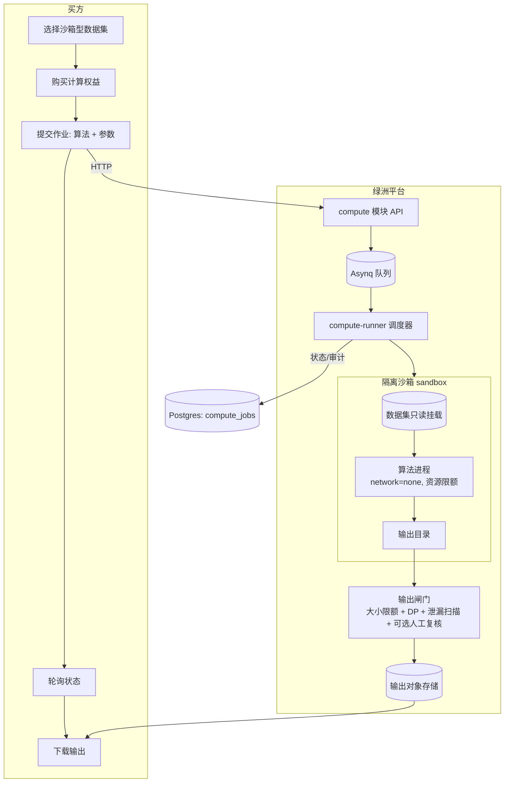

# 绿洲 · 隐私计算与「可用不可见」设计文档（Compute-to-Data）

**日期**：2026-06-02
**状态**：方案 v1.1（已做"抗压"加固——安全 §7.3/§7.4、合规 §16、可靠性 §17、runner 协议 §18、对抗测试 §19、风险登记 §22 补强；供新会话评审后开工；本文不含已落地代码，仅设计）
**范围**：在现有"买即下载原始数据"之上，新增**数据沙箱 / 计算到数据（Compute-to-Data, C2D）**能力——买方获得**计算结果**（模型/统计/查询）而非原始数据，实现"可用不可见"。
**作者**：平台技术

> 本文是一次**大方向**立项设计，预计 4 个阶段、多个 PR。**先评审、后开工**。新会话请先读 §0。

---

## 0. 给新会话的上手须知（READ FIRST）

> 新会话没有上下文记忆。本节让你在不依赖历史对话的情况下能独立开工。

### 0.1 项目是什么
**Verdant Oasis（绿洲）** 是一个**面向中国市场的 AI 训练数据交易平台**。理念："在数据荒漠中筑起一片纯净绿洲"。运营主体：杭州科农绿洲生物科技有限公司。

### 0.2 代码与分支
- 代码在 **`~/ai-data-marketplace`**（git 仓库，远程 `origin` = GitHub `exergyleizhou-ux/ai-data-marketplace`，默认分支 `main`）。
- **当前 `~/ai-data-marketplace` 这棵工作树停在旧分支 `feat/h3-settlement-outbox`，且有一堆早期未跟踪文件——不要在那棵树上直接干活。**
- 真实最新代码看 **`origin/main`**（`git fetch origin` 后以 `origin/main` 为准）。
- **工作流（务必遵守）**：每个任务 `git worktree add ~/ai-data-marketplace-<name> -b feat/<name> origin/main` 建独立工作树 → 本地全验证 → push → `gh pr create --base main` → 看 CI 三个 job 全绿 → `gh pr merge --squash --delete-branch` → `git worktree remove`。一棵树只做一件事，不混用。

### 0.3 技术栈与工具链（手装在 ~ 下，需手动 PATH）
- **Go 1.23**：`~/.local/bin/go`（`export PATH="$HOME/.local/bin:$PATH"`）。后端：gin + pgx/v5 + pgxpool + Postgres，模块化单体，Asynq（Redis）异步 worker，对象存储抽象（本地/S3/MinIO）。
- **Node 20**：`~/sdk/node/bin`。前端：Next.js（app router）+ React + Tailwind + TypeScript。
- **Postgres**：`~/sdk/pg/bin`（server-only，无 psql）。本地起临时库验证迁移/SQL：`initdb` → `pg_ctl -o "-p <port> -k <sock> -c listen_addresses=''" start`，连 `postgres://postgres@/postgres?host=<sock>&port=<port>`，用 `db.RunMigrations(dsn)` 跑迁移。
- **Python 3.11** venv：`~/sdk/sidecar-venv`（已装 PaperGuard 2.17.0、pyarrow、mlcroissant、fastapi）。
- **CI**（`.github/workflows/ci.yml`）三 job：`backend`（gofmt gate + vet + build + `go test -race` 连真 Postgres service）、`frontend`（tsc + lint + build）、`sidecar`（装 PaperGuard 跑 pytest）。所有 PR 必须三 job 全绿。

### 0.4 后端约定（照抄现有模式）
- 模块在 `backend/internal/modules/<name>/`：`model.go`（DTO/常量/错误）、`repo.go`（`Repository` 接口 + `pgRepo` 实现 + `scanXxx`）、`service.go`（业务，依赖 `Repository` 接口，单测用内存 `fakeRepo`）、`handler.go`（gin handler）、`router.go`（注册路由）、`doc.go`、`*_test.go`。
- HTTP 统一 `internal/platform/httpx`（`httpx.OK`、`httpx.Fail`、`httpx.UserID(c)`）。审计 `internal/platform/audit`。指标 `internal/platform/metrics`。
- 真库集成测试：`*_integration_test.go` 用 `os.Getenv("DATABASE_URL")` 门控（不设则 `t.Skip`），CI 的 backend job 会设 `DATABASE_URL` 跑它们。
- **迁移**：`backend/migrations/0000NN_xxx.up.sql` / `.down.sql`，embed 进二进制（`migrations/embed.go`），`db.RunMigrations` 应用。**当前最高 000009，下一个 000010。**

### 0.5 现有相关能力（C2D 要复用/集成的）
- **dataset 模块**：数据集 CRUD、上传（分片）、质检流水线（format/stats/dedup/pii/pii_redaction/authenticity/schema 写入 `quality_checks`）、来源声明、状态机（draft→uploading→checking→reviewing→published→...）。
- **order/payment/delivery 模块**：订单状态机、Stripe Connect + 微信/支付宝分账结算、交付（临时下载链接 + 交付指纹）。
- **已建只读端点**（dataset）：`GET /datasets/:id/quality`（质检报告）、`/schema`（在 quality 里）、`/croissant`（MLCommons JSON-LD）、`/versions`、`/certificate`（数据存证凭证·一数一码 = `VO-<SHA256(datasetID:contentSHA)前12hex>`）、Datasheet（数据说明卡）。
- **法律**：`/terms`、`/privacy` 已按律师定稿（中英双语，`frontend/components/Legal.tsx` 为品牌+条款源，`frontend/lib/legal.ts` 管版本触发重新同意）。

### 0.6 文档地图（v1.1 加固新增，按重要性读）
- **§2 信任阶梯** + **§7.3/§7.4**（模型记忆化、日志旁路）：决定 P1 能否安全上线，**先读**。
- **§16 中国合规与政策映射**：数据二十条/三权分置、PIPL/数据安全法、等保 2.0、国密、数据出境、数交所对接——**最大抗压面**。
- **§17 可靠性/运维/SLO**、**§18 runner↔后端协议与数据编排**、**§19 对抗性安全测试套件（必交付）**、**§20 起步算法目录**、**§21 计费经济细则**、**§22 未决风险登记册**。
- **§0–§15 为原始立项内容**，编号不变；**§15 仍是 P1 最小切片落地清单（新会话入口）**。
- 本版补强不改变 §15 的范围，只把它的**安全前置、并发正确性、合规边界、验收口径**讲死，避免开工后返工。

---

## 1. 背景与目标

### 1.1 现状与缺口
当前模式：买方下单 → 付款 → **下载原始数据**（gated 链接 + 交付指纹）。问题：
- 原始数据一旦交付即**脱离平台控制**，可被二次扩散，卖方议价与维权困难。
- 高敏感/高价值数据（医疗、金融、独家语料）卖方**不愿出售原始拷贝**。
- 这正是中国数据交易所（上海/北京/深圳）的核心命题：**数据"可用不可见"、不出域**。

### 1.2 目标
让买方获得**数据的价值**（训练好的模型、统计结果、查询答案）而**不获得原始数据本身**。即在现有"下载型"商品之外，新增**"沙箱计算型 / 可用不可见型"**商品。

### 1.3 非目标（本期不做）
- 不替换现有下载型交易（二者并存，卖方按数据集选择售卖模式）。
- 不自研密码学原语（MPC/同态用成熟库，不手搓）。
- Phase 1 不追求"平台也不可见"（那是 TEE 阶段，见 §2）。

---

## 2. 信任阶梯（核心概念，务必先对齐）

"可用不可见"不是一个开关，而是**逐级增强的信任模型**。设计必须区分"对谁不可见"：

| 级别 | 名称 | 对**买方**不可见？ | 对**平台**不可见？ | 技术 | 本方案阶段 |
|---|---|---|---|---|---|
| **L0** | 下载型（现状） | ❌ 买方拿到原始数据 | ❌ | 直接交付 | 已有 |
| **L1** | **数据沙箱（买方不可见）** | ✅ 买方只拿输出 | ❌ 平台跑沙箱仍可见数据 | 隔离容器 + egress 阻断 + 输出闸门 | **Phase 1–2** |
| **L2** | **机密计算（平台也不可见）** | ✅ | ✅ 数据仅在 TEE 内解密 | TEE + 远程证明 | **Phase 3** |
| **L3** | **数据不出域** | ✅ | ✅ | 联邦学习 / MPC（跨多卖方，数据不集中） | **Phase 4** |

> **关键诚实点**：L1 = "**买方**可用不可见"，平台运营方仍能访问数据（和现状一样，平台本就托管数据）。只有 L2（TEE）才是"**连平台都不可见**"的真·可用不可见。产品文案与法律条款必须如实区分，不可把 L1 宣传成 L2（与绿洲一贯的"信号非结论/不夸大"立场一致）。
>
> 每一级都叠加 **差分隐私（DP）** 对输出加噪/限额，防止"把原始数据编码进输出"的泄漏（§8）。
>
> **L1 的真实安全边界 = 被审核的算法代码，不是沙箱。** `--network none` 之后，唯一的外泄出口就是"输出"本身，而**输出内容由算法决定**。因此 L1 对**模型型输出**的安全性，**只在算法代码经平台审核（`trusted`）时成立**；让买方自带算法在 L1 跑模型训练是不安全的（权重可记忆原始样本，见 §7.3）。**这是硬约束，不是建议**：P1 的 offer 若 `trust_level='L1'` 且 `output_kind='model'`，则 `allow_custom` 必须为 false，只能选 `trusted=true` 的白名单算法。沙箱（Docker/gVisor）防的是"算法乱来"（越权读、外联、逃逸），**防不住"算法老老实实把数据塞进它被允许产出的那个输出里"**——后者只能靠审核算法代码 + DP + 大小限额。

参考实现（对标，辩证吸收）：Ocean Protocol **Compute-to-Data**（最清晰的开源 C2D 架构）；国内**翼方健数、华控清交、蓝象智联、蚂蚁摩斯、富数科技**；北京国际大数据交易所 **IDeX 测试沙箱**；上海数交所"数据产品登记凭证 + 全链路存证"。

---

## 3. 总体架构（Compute-to-Data）

核心：买方提交**计算作业（job）**，平台在**数据所在的隔离环境**里运行，只回**输出**，原始数据永不离开。



**生命周期状态机（`compute_jobs.status`）**：
```
created → queued → running → output_pending ─┬─────────────→ released
   │         │        │                       └→ output_reviewing → released
   │         │        │                                          ↘ rejected
   │         │        └→ (runner 崩溃/租约过期 且 attempts<max) → queued   [崩溃重试]
   │         │        └→ (attempts≥max 或不可重试错误) → failed
   │         ↘ canceled (买方在执行前取消)
   ↘ failed (前置校验失败)
```
- `created`：作业已创建（已原子扣减额度、校验权益/算法/参数）。
- `queued`：已入 Asynq 队列，等待 runner 认领。
- `running`：被某 runner 认领（写 `runner_id`/`lease_until`），沙箱执行中。
- `output_pending`：执行完成，输出进入闸门（大小/DP/泄漏自动判定）。
- `output_reviewing`：高敏感数据集（offer 标记）需 ops 人工复核时的中间态。
- `released`：输出已放行，买方可下载。
- `rejected`：输出被闸门或人工拒绝（数据不放行；计费策略见 §21）。
- `failed`：前置校验失败，或执行重试耗尽 / 不可重试错误。
- `canceled`：买方在 `running` 前主动取消（额度回滚）。

> **崩溃恢复（at-least-once + 幂等放行）**：runner 认领作业即持有**租约**（`lease_until`，定期心跳续约）。若 runner 崩溃使租约过期而作业仍 `running`，回收器把它在 `attempts<max` 时退回 `queued` 重排、否则置 `failed`。因为可能重跑，**放行必须幂等**：以 `(job_id)` 为键写一次输出对象与 `released`，重复完成不得重复扣额度、不得重复计费、不得产生两份可下载输出（沿用本仓库 H3 settlement-outbox 的 exactly-once 思路）。算法须假定**可能被重跑**（用固定随机种子保证可复现，便于争议复算，见 §21）。

**组件**（新增）：
1. `compute` 后端模块（owns `compute_jobs`/`algorithms`/`compute_entitlements`）。
2. **compute-runner**（沙箱执行器）：独立服务/worker，负责拉数据→起隔离容器→跑算法→收输出。**复刻 PaperGuard sidecar 模式**（独立进程、清晰契约、可独立伸缩）。
3. **输出闸门**：大小限额 + DP 加噪 + 泄漏启发式 + 可选人工复核。

---

## 4. 数据模型（迁移 000010）

> **前置约定**：`gen_random_uuid()` 用 PG13+ 内置或 `pgcrypto`（现有迁移已启用，沿用）；金额一律 `BIGINT`（分）；时间一律 `TIMESTAMPTZ`。相对 v1.0，新增列集中解决四类坑：**镜像按 digest 钉死**、**额度原子扣减 + 退款吊销**、**作业幂等/租约/崩溃重试**、**DP 累计上限 + 日志旁路**。§15 的 P1 可取子集，但 `image_digest`、`compute_entitlements.status`、`compute_jobs.idempotency_key/attempts/lease_until` **P1 就要带上**——事后补列代价大且极易漏掉并发坑。

```sql
-- 算法登记：经平台审核的可信算法（白名单），以及买方自定义镜像（高级、需更强隔离）
CREATE TABLE algorithms (
    id            UUID PRIMARY KEY DEFAULT gen_random_uuid(),
    owner_id      UUID REFERENCES users (id),         -- NULL = 平台内置
    name          TEXT NOT NULL,
    runtime       TEXT NOT NULL,                       -- 'python-sklearn' | 'python-lightgbm' | 'sql' | 'custom-image'
    image         TEXT NOT NULL,                       -- 容器镜像引用（白名单基础镜像或卖方/平台审核镜像）
    image_digest  TEXT NOT NULL,                       -- 镜像内容寻址摘要 sha256:...；审核钉死此 digest，**禁用可变 tag（:latest）**，否则审核失效
    version       INT  NOT NULL DEFAULT 1,             -- 算法版本：代码/镜像变更即 +1；审核针对具体版本，保证可复现 + 可审计
    source_ref    TEXT NOT NULL DEFAULT '',            -- 源码 / 审核记录引用（git ref 或审核工单号）；trusted 算法必填
    entrypoint    TEXT NOT NULL DEFAULT '',
    params_schema JSONB,                               -- 参数 JSON Schema（前端据此渲染表单 + 后端校验）
    output_kind   TEXT NOT NULL,                       -- 'model' | 'metrics' | 'table' | 'aggregate'
    status        TEXT NOT NULL DEFAULT 'pending'      -- pending | approved | rejected | disabled
                       CHECK (status IN ('pending','approved','rejected','disabled')),
    trusted       BOOLEAN NOT NULL DEFAULT false,      -- 平台审核通过、可对敏感数据运行
    created_at    TIMESTAMPTZ NOT NULL DEFAULT now(),
    updated_at    TIMESTAMPTZ NOT NULL DEFAULT now()
);

-- 数据集的沙箱售卖配置（与下载型并存；一个数据集可同时开放下载/沙箱）
CREATE TABLE dataset_compute_offers (
    dataset_id        UUID PRIMARY KEY REFERENCES datasets (id) ON DELETE CASCADE,
    enabled           BOOLEAN NOT NULL DEFAULT false,
    allow_custom      BOOLEAN NOT NULL DEFAULT false,  -- 是否允许买方自定义算法（否=仅白名单）
    allowed_algorithm_ids UUID[] NOT NULL DEFAULT '{}', -- 卖方允许的算法子集（空=全部 approved）
    price_cents       BIGINT NOT NULL DEFAULT 0,        -- 单次作业价（或权益价）
    max_runtime_secs  INT NOT NULL DEFAULT 1800,
    max_output_bytes  BIGINT NOT NULL DEFAULT 10485760, -- 10 MiB 输出上限（防整库导出）
    dp_epsilon        DOUBLE PRECISION,                 -- 单次作业默认 DP 预算（聚合型输出，注入 job.dp_epsilon）
    dp_epsilon_total  DOUBLE PRECISION,                 -- 每买方在本数据集累计 ε 天花板（dp_budget_ledger 的上限；NULL=暂不限，仅 L1 早期可接受）
    max_output_files  INT NOT NULL DEFAULT 16,          -- 输出文件数上限（防用"多小文件"绕过单体大小限额）
    return_logs       BOOLEAN NOT NULL DEFAULT false,   -- 是否向买方返回算法日志（默认否——stdout/stderr 是外泄旁路，见 §7.4）
    review_output     BOOLEAN NOT NULL DEFAULT false,   -- 输出是否需 ops 人工复核（高敏感数据集置 true → output_reviewing）
    trust_level       TEXT NOT NULL DEFAULT 'L1'        -- L1 | L2 | L3（见 §2）
                           CHECK (trust_level IN ('L1','L2','L3')),
    updated_at        TIMESTAMPTZ NOT NULL DEFAULT now()
);

-- 买方计算权益（一次购买可含 N 次作业额度）
CREATE TABLE compute_entitlements (
    id            UUID PRIMARY KEY DEFAULT gen_random_uuid(),
    dataset_id    UUID NOT NULL REFERENCES datasets (id) ON DELETE CASCADE,
    buyer_id      UUID NOT NULL REFERENCES users (id) ON DELETE CASCADE,
    order_id      UUID REFERENCES orders (id),         -- 复用现有支付/结算
    jobs_quota    INT NOT NULL DEFAULT 1,
    jobs_used     INT NOT NULL DEFAULT 0,               -- 扣减须原子：UPDATE ... SET jobs_used=jobs_used+1 WHERE id=$1 AND jobs_used<jobs_quota AND status='active' RETURNING（行级锁，防并发超发）
    status        TEXT NOT NULL DEFAULT 'active'        -- active | exhausted | expired | revoked
                       CHECK (status IN ('active','exhausted','expired','revoked')),
    expires_at    TIMESTAMPTZ,
    created_at    TIMESTAMPTZ NOT NULL DEFAULT now()
    -- 退款/争议：现有 H2 退款冲正成功后置 status='revoked'，阻止其下未放行作业（联动 §21）
);

-- 计算作业
CREATE TABLE compute_jobs (
    id              UUID PRIMARY KEY DEFAULT gen_random_uuid(),
    dataset_id      UUID NOT NULL REFERENCES datasets (id) ON DELETE CASCADE,
    version_id      UUID REFERENCES dataset_versions (id),
    buyer_id        UUID NOT NULL REFERENCES users (id) ON DELETE CASCADE,
    entitlement_id  UUID NOT NULL REFERENCES compute_entitlements (id),
    algorithm_id      UUID REFERENCES algorithms (id),
    algorithm_version INT,                              -- 钉住执行时的算法版本（可复现、可争议复算）
    params            JSONB,
    idempotency_key   TEXT,                             -- 幂等键：同 entitlement 重复提交去重（唯一索引见下）
    status            TEXT NOT NULL DEFAULT 'created'
                           CHECK (status IN ('created','queued','running','output_pending','output_reviewing','released','failed','rejected','canceled')),
    attempts          INT NOT NULL DEFAULT 0,           -- 已尝试次数；≥max 转 failed（崩溃重试，见 §3/§17）
    runner_id         TEXT,                             -- 认领该作业的 runner 实例（租约归属）
    lease_until       TIMESTAMPTZ,                      -- 租约到期时间；过期且仍 running 视为崩溃，可回收重排
    dp_epsilon        DOUBLE PRECISION,
    output_key        TEXT,                             -- 输出对象存储 key
    output_bytes      BIGINT,
    output_kind       TEXT,
    logs_key          TEXT,                             -- 经审查的算法日志 key（仅当 offer.return_logs 且通过日志闸门，见 §7.4）
    error             TEXT,                             -- 给买方的**已脱敏**错误码/摘要（**绝不回传原始 stdout/stderr**）
    attestation       JSONB,                            -- L2 TEE 远程证明报告（Phase 3）
    created_at        TIMESTAMPTZ NOT NULL DEFAULT now(),
    started_at        TIMESTAMPTZ,
    finished_at       TIMESTAMPTZ
);
CREATE INDEX idx_compute_jobs_buyer  ON compute_jobs (buyer_id, created_at DESC);
CREATE INDEX idx_compute_jobs_status ON compute_jobs (status);
-- 幂等：同一权益下相同幂等键只建一份作业
CREATE UNIQUE INDEX idx_compute_jobs_idem ON compute_jobs (entitlement_id, idempotency_key) WHERE idempotency_key IS NOT NULL;
-- 租约回收扫描：快速找过期租约的在跑作业
CREATE INDEX idx_compute_jobs_lease ON compute_jobs (status, lease_until) WHERE status = 'running';

-- 数据集每个买方的 DP 预算消耗（防多次查询累计泄漏；Phase 2+）
CREATE TABLE dp_budget_ledger (
    id            UUID PRIMARY KEY DEFAULT gen_random_uuid(),
    dataset_id    UUID NOT NULL REFERENCES datasets (id) ON DELETE CASCADE,
    buyer_id      UUID NOT NULL REFERENCES users (id) ON DELETE CASCADE,
    job_id        UUID REFERENCES compute_jobs (id),
    epsilon_spent DOUBLE PRECISION NOT NULL,
    created_at    TIMESTAMPTZ NOT NULL DEFAULT now()
);
```

---

## 5. 后端模块 `compute`（照现有模式）

`backend/internal/modules/compute/`：
- `model.go`：`Algorithm`、`ComputeOffer`、`ComputeJob`、`Entitlement` DTO + 状态常量 + 错误。
- `repo.go`：`Repository` 接口（CreateJob/GetJob/ListJobsByBuyer/AdvanceStatus/SetOutput/RegisterAlgorithm/ListApprovedAlgorithms/GetOffer/UpsertOffer/SpendDP/...）+ `pgRepo` + `fakeRepo`（测试）。
- `service.go`：业务——权益校验、算法白名单校验、参数 JSON Schema 校验、入队、状态推进、与 `order` 模块集成（购买权益）、与 `delivery` 集成（输出交付）。**通过接口依赖 dataset/order，不互相 import 内部**（沿用现有跨模块边界约定）。
- `handler.go` / `router.go`：见 §6。
- `runner.go` + **compute-runner sidecar**：见 §7。

**与现有模块集成**：
- **支付**：购买计算权益 = 创建一个 `order`（type=compute），走现有 Stripe Connect/分账结算。`compute_entitlements.order_id` 关联。
- **交付**：作业输出走现有 `delivery` 模块（临时链接 + 指纹）。
- **质量/存证**：沙箱型数据集照样有质检/Schema/存证凭证；商品页加"可用不可见"徽章 + 信任级别（L1/L2/L3）。

---

## 6. API 契约

**卖方（authed, owner）**
- `PUT /datasets/:id/compute-offer` — 开启/配置沙箱售卖（enabled, allow_custom, allowed_algorithm_ids, price, limits, trust_level, dp_epsilon）。
- `GET /datasets/:id/compute-offer` — 读配置（公开只读给买方看价/级别）。

**买方（authed）**
- `GET /algorithms?dataset_id=` — 该数据集可用的已审核算法 + 参数 schema。
- `POST /datasets/:id/compute/purchase` — 购买计算权益（创建 order → 付款 → entitlement）。
- `POST /compute/jobs` — 提交作业 `{ dataset_id, entitlement_id, algorithm_id, params }`（或自定义镜像，若 offer 允许）。返回 job。
- `GET /compute/jobs/:id` — 轮询状态/错误/输出元信息。
- `GET /compute/jobs/:id/output` — 放行后下载输出（经 delivery）。
- `GET /users/me/compute/jobs` — 我的作业列表。

**运营（ops）**
- `GET /admin/algorithms?status=pending` / `POST /admin/algorithms/:id/review` — 算法审核（approved/rejected/trusted）。
- `GET /admin/compute/jobs?status=output_pending` / `POST /admin/compute/jobs/:id/output-review` — 输出人工复核（放行/拒绝），用于高敏感数据集。

---

## 7. 沙箱与安全（威胁模型——本方案最关键部分）

### 7.1 威胁与对策
| 威胁 | 对策 |
|---|---|
| 算法**网络外传**原始数据 | 容器 `--network none`（无任何网络），无 DNS、无出站 |
| 算法**读取host/其他数据** | 只读挂载本数据集到固定路径；rootfs 只读；无 host FS、无 docker.sock；seccomp/AppArmor/最小 capabilities |
| 算法把**原始数据编码进输出** | 输出**大小硬上限**（`max_output_bytes`）+ 聚合型输出走 **DP**（§8）+ **算法白名单**（敏感数据只许 trusted 算法）+ **可选人工复核** |
| 资源耗尽 / 死循环 | CPU/内存/PID/磁盘配额 + `max_runtime_secs` 超时杀进程 |
| 镜像投毒 | 仅白名单基础镜像；自定义镜像需 ops 审核 + 镜像签名校验 |
| 多次查询**累计泄漏** | `dp_budget_ledger` 按 (数据集,买方) 记账，超预算拒绝（§8） |
| 平台内鬼/主机被攻破（L2 目标） | TEE 机密计算 + 远程证明（§9）——数据仅在 enclave 内明文 |
| 算法把数据**记忆进模型权重**（成员推断/模型反演/训练数据提取） | **本质风险，沙箱防不住**：模型型输出**只许 trusted 白名单算法**（代码经审计）+ 输出大小限额 + 可选 DP-SGD + 可选记忆化自检；买方自带算法**禁止**产模型（详见 §7.3） |
| 算法借 **stdout/stderr/错误信息/文件名** 旁路外泄 | 日志默认**不回传买方**；需回传则走**日志闸门**（结构化白名单字段、正则脱敏、大小限额）；`error` 只存脱敏码（详见 §7.4） |
| 输出**撑爆磁盘**（变相 DoS / 绕过限额） | 写时即数边界：超 `max_output_bytes`/`max_output_files` 立即杀进程并 `rejected`（不是跑完再查） |
| **容器逃逸**（Docker 共享宿主内核） | P1 Docker **不是硬安全边界**，故 P1 **仅白名单可信算法**；硬隔离靠 P2 gVisor/Firecracker、敏感数据靠 P3 TEE |
| 额度**并发超发** / 重复提交 | 额度原子扣减（行级锁）+ 作业 `idempotency_key` 唯一索引（见 §4） |
| 数据装载**时序**被利用（边联网边读数据） | runner 在宿主先拉数据→校验哈希→只读挂载→**再对算法容器切断网络**；算法容器全程无网（见 §18） |
| 镜像**可变 tag** 致审核失效 | 按 `image_digest`（sha256）钉死并校验，禁用 `:latest`（见 §4） |

### 7.2 沙箱运行时选型（按隔离强度递进）
- **Phase 1（开发/MVP）**：Docker + `--network none` + 只读挂载 + 资源 limits + seccomp 默认 profile。够验证全链路。
- **Phase 2（生产隔离）**：**gVisor（runsc）** 或 **Firecracker microVM**（用户态内核/微虚机，强隔离，启动快）。
- **Phase 3（L2 机密计算）**：**Confidential VM / TEE**——阿里云加密计算/Intel TDX、Azure Confidential VM（AMD SEV-SNP）、GCP Confidential VM；或 SGX + **Gramine**。配**远程证明**写入 `compute_jobs.attestation`，卖方可验。

> **compute-runner = 独立 sidecar 服务**（像 paperguard-sidecar）：Go 后端通过队列/HTTP 把作业交给 runner；runner 负责容器编排。这样后端不直接碰容器运行时，便于把 runner 部署到带 TEE 的专用节点。

### 7.3 模型输出记忆化——L1 最难、沙箱无法解决的威胁
这是 C2D 在"训练型"商品上最容易被安全评审撕开的点，必须正面写清：

- **风险**：模型权重会**记住训练样本**。过参数化模型、深网、语言模型尤甚（语言模型可逐字背诵训练串）。攻击面包括**成员推断（MIA）**、**模型反演**、**训练数据提取**。一个 10 MiB 模型能编码相当多原始数据，`max_output_bytes` 只能粗约束，**挡不住"算法把数据精心编码进它被允许产出的模型里"**。
- **根因**：L1 沙箱（`--network none` + 只读挂载）只能阻止"算法乱来"（外联、越权读、逃逸），**阻止不了"算法合规地把数据写进合法输出"**。因此模型型输出的安全性 = **算法代码的可信度**，而非隔离强度。
- **分级对策**：
  1. **L1 模型型输出只允许 `trusted` 白名单算法**（代码经平台审计：确认不刻意外泄、不返回逐样本中间产物）。**买方自带算法 + 模型输出 = 禁止**（offer 层校验，见 §2 硬约束）。
  2. **限制输出形态**：只回**最终模型 + 聚合指标**；**禁止**回**逐样本预测 / 嵌入向量 / 最近邻索引 / 原始特征**——这些是高保真泄漏。
  3. **DP-SGD（可选）**：给"训练型 + 高隐私"场景，梯度裁剪 + 噪声，提供形式化 (ε,δ) 保证（OpenDP/Opacus），代价是掉点。
  4. **记忆化 / MIA 自检（P2+）**：放行前用影子查询估计模型对训练样本的记忆程度，超阈值 `rejected`。
  5. **诚实标注**：商品页对 L1 模型输出标注"买方不可见原始数据，但模型本身可能含统计痕迹；需更强保证请选 L2/TEE"，与品牌"信号非结论 / 不夸大"一致。

### 7.4 旁路通道：日志 / 错误 / 文件名 / 时序 / 反序列化
`--network none` 后，除"输出文件"外的次级外泄路径，必须逐一堵死：

- **stdout/stderr**：算法可 `print(原始行)`。默认 `offer.return_logs=false`，后端**绝不**把原始 stdout 透给买方。需给买方调试信息时：算法走**结构化日志协议**（仅白名单事件/阶段/计数），runner 端**日志闸门**做正则脱敏 + 大小限额后存 `logs_key`。
- **error 字段**：同理只存**平台侧脱敏错误码/摘要**，不透传异常 message（异常常裹挟数据片段）。
- **文件名 / 输出键**：算法**不得用文件名编码数据**——输出文件名由平台规范化生成，不采纳算法自定义名。
- **时序 / 资源侧信道**：执行时长、内存峰值**不回传买方**（只回终态）。L1 不追求抗时序侧信道（那是 L2/TEE 范畴），但**不主动暴露**计时。
- **pickle / 反序列化 RCE**：模型多为 `.pkl`，**平台自身永不反序列化买方输出**（对平台是不透明 blob）；下载页提示买方"仅在可信环境加载"。平台若需读输出元信息，用安全格式（JSON metrics），绝不 `pickle.load`。

---

## 8. 差分隐私（DP）与输出治理
- **聚合/统计/查询型输出**（output_kind=aggregate/metrics）：用成熟 DP 库（**OpenDP**、Google **differential-privacy**、IBM **diffprivlib**）对结果加拉普拉斯/高斯噪声，按 `dp_epsilon` 控制。
- **DP 预算记账**：每次作业消耗 ε 写 `dp_budget_ledger`；同一 (数据集,买方) 累计 ε 超上限则拒绝新作业（防"多次查询逼近原始值"）。
- **模型型输出**（output_kind=model）：DP 难直接套；靠 **算法白名单 + 输出大小限额 + 训练用 DP-SGD（可选）+ 人工复核**。可选做**成员推断/记忆化检测**（高级）。
- **泄漏启发式**：输出与原始数据相似度扫描（如输出行数/熵接近原始 → 拒绝）。
- **预算上限来源**：`offer.dp_epsilon_total` = 每买方在该数据集的**累计 ε 天花板**；新作业前检查 `Σε(已花) + 本次ε ≤ total`，否则拒绝。账本（`dp_budget_ledger`）只记账，**天花板在 offer**——v1.0 漏了"上限存哪"，这里补死。
- **组合定理（composition）**：多次查询的隐私损失按**顺序组合**累加（保守=线性加 ε）；查询量大时用 **高级组合 / RDP / zCDP** 折算更紧。账本记每次 (ε, δ, 机制) 以便换算。
- **DP 对模型输出的诚实局限**：DP 加噪天然适配**聚合/统计**；模型型只能在**训练时**用 DP-SGD（§7.3），**不能事后对成品模型"加噪救场"**。文案/条款**不得**暗示"L1 模型输出有 DP 保证"。
- **默认与拒绝语义**：ε 默认值由业务/合规定（§14.4）；预算耗尽返回**明确错误码**，**绝不静默降级**为无噪输出。
- **输出闸门固定流水**（放行前顺序执行，任一步失败 → `rejected`）：① 大小/文件数限额（写时即数）→ ② 泄漏启发式 → ③ DP 加噪（若 `output_kind∈{aggregate,metrics}`）→ ④ DP 预算记账 → ⑤（`offer.review_output`）人工复核 → ⑥ 写对象存储 + `released`。计费按 §21。

---

## 9. L2/L3 路线（Phase 3–4）
- **L2 机密计算（平台不可见）**：沙箱跑进 TEE；数据用卖方密钥加密，**仅在 enclave 内解密**；**远程证明**向卖方证明"只有约定代码在真 enclave 内处理了数据"。产出 `attestation` 报告，商品页展示"L2·机密计算"徽章。
- **L3 数据不出域（联邦/MPC）**：
  - **联邦学习**：多卖方各自本地训练，平台只聚合梯度/参数（FedAvg）；原始数据不集中。适合"多卖方联合训练一个模型"。
  - **MPC**：秘密分享 + 联合计算，适合**跨数据集联合统计/隐私求交（PSI）/联合建模**（线性模型、风控评分）。用 **Secretflow（蚂蚁，开源）/ FATE / MP-SPDZ** 等成熟框架，不自研。

---

## 10. 与支付 / 法律 / 品牌的集成
- **支付**：计算权益购买 = order（现有分账结算）。定价：按次（per-job）或按权益额度。卖方在 offer 设价。
- **法律（必须新增条款）**：现行《用户服务协议》是"数据交付"模型。C2D 需**新增条款**：①沙箱型交易**不交付原始数据**，仅交付计算结果；②买方对其提交算法的合法性/安全性负责；③输出物的知识产权归属与使用范围；④L1/L2/L3 的"可用不可见"**如实界定**（L1 平台可见、L2 平台不可见），不得夸大。→ 走现有 `Legal.tsx` + `lib/legal.ts` 版本号 bump 触发重新同意。**完整中国合规与政策映射（数据二十条/三权分置、PIPL、数据安全法、等保 2.0、国密、数据出境、数交所对接）见 §16——这是本产品最大的抗压面。**
- **质量/存证**：沙箱型数据集照样质检 + 存证凭证；商品页加 **"可用不可见 L1/L2/L3"** 徽章。
- **品牌**：与"纯净绿洲 / 信号非结论"一致——文案如实标注信任级别，不夸大。

---

## 11. 分阶段 PR 计划

| 阶段 | 目标 | 主要 PR（建议拆分） | 验收 |
|---|---|---|---|
| **P1 全链路打通（L1, Docker 沙箱）** | 买方能购买权益→提交白名单算法作业→拿到输出，原始数据不交付给买方 | ①迁移000010 + compute 模型/repo（真库集成测试）②service 状态机 + 权益/算法校验（单测）③API + 前端（卖方开启 offer、买方提交作业/轮询/下载）④compute-runner sidecar（Docker `--network none` 跑一个内置 sklearn 算法）⑤一条内置算法（如"训练逻辑回归并返回模型+指标"） | `go test -race` 全绿；本地 docker 沙箱端到端跑通一个真实作业；迁移对真 PG 通过；前端 tsc/lint/build |
| **P2 隔离硬化 + 输出治理** | 生产级隔离 + 防输出泄漏 | ①gVisor/Firecracker 运行时 ②输出闸门（大小限额、DP 加噪、泄漏启发式）③DP 预算记账 ④算法审核工作流（ops）⑤资源/超时限额 | 渗透式测试：算法无法外传/读越权；DP 预算超限被拒；超时被杀 |
| **P3 L2 机密计算（TEE）** | 平台也不可见 + 远程证明 | ①Confidential VM/TEE runner ②卖方密钥加密数据、enclave 内解密 ③远程证明写 attestation + 卖方可验 + 商品页徽章 | 证明报告可被独立验证；数据在 host 上始终密文 |
| **P4 L3 数据不出域** | 联邦/MPC | ①联邦学习聚合（FedAvg）②MPC 隐私求交/联合统计（Secretflow/MP-SPDZ）③跨数据集联合作业 | 多方端到端；原始数据不集中 |
| **法律（并行）** | C2D 条款 | ToS 新增 C2D 章节 + bump LEGAL_VERSIONS | 律师确认；重新同意生效 |

> **建议先做 P1 的最小切片**（§15），把"购买→作业→输出"骨架立起来，再逐级加固。

---

## 12. 技术选型小结
| 维度 | 选型 |
|---|---|
| 沙箱（P1→P3） | Docker `--network none` → gVisor/Firecracker → Confidential VM/TEE(TDX/SEV-SNP/SGX+Gramine) |
| 算法运行时 | Python 容器（sklearn/lightgbm/pandas）；SQL 查询型；自定义镜像（审核+签名） |
| DP | OpenDP / Google DP / diffprivlib |
| 联邦/MPC（P4） | Secretflow（蚂蚁开源）/ FATE / MP-SPDZ |
| 编排 | Asynq 入队 + compute-runner sidecar（独立服务，复刻 paperguard-sidecar 模式） |
| 远程证明（P3） | 云厂商 attestation API / 开源 enclave 工具链 |

---

## 13. 本地开发与验证
- **沙箱**：开发机用 Docker（`docker run --rm --network none --read-only -v <data>:/data:ro -v <out>:/out --memory=512m --cpus=1 --pids-limit=128 <algo-image>`）。**注意当前环境无 docker 时**，P1 可先做一个**进程级 mock runner**（在受限子进程里跑，env 注入 `NO_NETWORK`），把状态机/契约/前端先打通，再换真容器（设计上 runner 是接口，mock/docker/gVisor/TEE 可替换）。
- **DB**：临时 PG（见 §0.3）跑迁移 + 集成测试。
- **CI**：backend job 跑 compute 的真库集成测试；新增算法镜像构建可放独立 job（或先不入 CI，文档说明）。
- **验证铁律**（沿用本仓库一贯做法）：每个 PR 本地 `go test -race` + gofmt + vet + 前端 tsc/lint/build + 迁移/SQL 对真 PG 验证；CI 三 job 全绿才合并。

---

## 14. 待决策清单（评审拍板）
1. **首发形态**：先做"**查询/统计型**（SQL + DP，简单、安全、快出）"还是"**训练型**（返回模型，价值高但泄漏面大）"？建议 **P1 先训练型的一个白名单算法**（逻辑回归/LightGBM）跑通骨架，统计型紧随。
2. **自定义算法**：P1 是否允许买方自定义镜像？建议 **P1 仅白名单**（安全面小），自定义留 P2 + 审核。
3. **TEE 云厂商**：阿里云加密计算 / Azure CVM / 自建 SGX？影响 P3。
4. **DP 默认 ε** 与预算上限：需业务/合规定。
5. **定价模型**：按次 vs 按权益额度 vs 包月。
6. **compute-runner 部署**：与后端同机（开发）vs 专用隔离节点（生产，尤其 TEE）。
7. **是否接入数据交易所**：上海/北京数交所对"沙箱/可用不可见"有对接规范，是否对齐其登记凭证。
8. **日志回传策略**：P1 是否一律 `return_logs=false`（买方拿不到任何算法日志）？建议**默认 false**，只回平台脱敏错误码；调试期仅对自有测试数据集开 true（见 §7.4）。
9. **GPU 训练支持**：首发是否支持 GPU（大模型训练买方会要）？GPU + 强隔离/TEE 成熟度低（gVisor 不友好、TEE+GPU=H100 CC 很新），建议 **P1 仅 CPU**，GPU 列 P3+ 评估（见 §17）。
10. **国密 / 商用密码**：数据加密、TEE 密钥、传输是否需用 SM2/SM3/SM4（数交所/等保常要求）？影响 §16 与 P3。
11. **计费时点与失败计费**：按购买计费还是按**成功放行**计费？平台故障 / 算法故障 / 闸门拒绝分别谁付费？（见 §21，须与现有结算/退款引擎对齐）
12. **等保定级与第三方评估时间表**：处理敏感数据的 C2D 平台何时做**等保 2.0 定级 + 渗透测试 + 合规评估**？直接决定能否承接医疗/金融数据（见 §16）。

---

## 15. 附：P1 最小切片落地清单（新会话可直接开工）

> 目标：买方购买计算权益 → 提交一个**内置白名单算法**（"训练逻辑回归，返回模型文件 + 准确率"）→ 平台在 **Docker `--network none` 沙箱**（无 docker 时用 mock runner）里跑 → 买方下载**输出**，**全程不向买方交付原始数据**。

> **P1 安全不变量（开工前必读，违反即不许上线）**：
> 1. **L1 + 模型输出 ⇒ 只许 `trusted` 白名单算法**，offer `allow_custom=false`（§2 / §7.3）。
> 2. **额度扣减原子**（行级锁）+ 作业 **`idempotency_key` 唯一** + 放行**幂等**（§3 / §4）。
> 3. **镜像按 `image_digest`（sha256）钉死**，禁用 `:latest`（§4）。
> 4. **不回传原始 stdout / 异常 message**；`return_logs` 默认 false（§7.4）。
> 5. **输出大小/文件数写时即数**，超限立即杀进程并 `rejected`（§7 / §8）。
> 6. 退款冲正（现有 H2）成功 ⇒ 权益置 `revoked`，阻止其下未放行作业（§21）。

1. **迁移 `000010_compute.up/down.sql`**：建 `algorithms`、`dataset_compute_offers`、`compute_entitlements`、`compute_jobs`（§4 的子集，DP 表留 P2）。
2. **`compute` 模块**：model/repo/service/handler/router/doc + `fakeRepo`。
   - Repository：`UpsertOffer/GetOffer`、`RegisterAlgorithm/ListApprovedAlgorithms`、`CreateEntitlement/GetEntitlement/SpendQuota`、`CreateJob/GetJob/AdvanceStatus/SetOutput/ListJobsByBuyer`。
   - service 状态机 + 权益/额度校验 + 参数 JSON Schema 校验 + 入队。
   - **真库集成测试**：建 user/dataset/offer/algorithm/entitlement → CreateJob → AdvanceStatus → SetOutput → 校验。
3. **compute-runner**：定义 `Runner` 接口 `Run(ctx, job, dataReader) (outputKey, err)`；提供 `dockerRunner`（`--network none` 跑算法镜像）+ `mockRunner`（受限子进程，开发/无 docker 时用）。Asynq worker 消费 `compute:job`。
4. **一个内置算法镜像**：`algorithms/logreg/`（Python：读 `/data` CSV → 训练 LogisticRegression → 写 `/out/model.pkl` + `/out/metrics.json`），白名单 approved+trusted。
5. **支付**：`POST /datasets/:id/compute/purchase` 创建 order（复用现有支付），成功后建 entitlement。
6. **前端**：
   - 卖方（sell 工作台）：每个数据集"开启沙箱售卖"开关 + 选允许算法 + 定价。
   - 买方（数据集详情页）：若 offer.enabled → "可用不可见"徽章 + "购买计算权益" → 选算法/填参数 → 提交作业 → 作业列表轮询 → 下载输出。
7. **法律**：ToS 加 C2D 段（并行，bump 版本）。
8. **对抗性安全测试（必交付，非可选）**：红队算法用例断言——`--network none` 下建 socket/DNS 失败、读 `/etc/passwd`/越权路径失败、写超 `max_output_bytes` 被杀、stdout 不出现在买方可见字段、额度并发不超发、超时被杀（详见 §19）。**这是 P1 验收门，不过不合并。**
9. **验证**：`go test -race`、gofmt/vet、前端 tsc/lint/build、迁移对真 PG、本地 docker 沙箱端到端、§19 红队用例全过、CI 三 job 全绿。

> 落地后即实现 **L1「买方可用不可见」**：买方拿到模型与指标，**从未拿到原始数据**。后续按 §11 逐级加固到 L2/L3。
> **抗压自检**：上线前对照 §22 风险登记册逐条确认"残余风险有主、有缓解、有诚实标注"。

---

## 16. 中国合规与政策映射（抗压关键）

> C2D / "可用不可见" 在中国不是技术噱头，而是**踩在国家数据要素制度的正中央**。把产品映射到政策框架，是面对监管、数交所、投资人时最强的抗压面；映射不清则反成合规风险。本节给出对齐方式与义务清单。**非法律意见，落地前须经法务/律师确认（沿用现有 Legal 流程）。**

### 16.1 「数据二十条」与三权分置——C2D 的政策正当性
《关于构建数据基础制度更好发挥数据要素作用的意见》（"数据二十条"）确立**数据资源持有权、数据加工使用权、数据产品经营权"三权分置"**，并倡导**"数据可用不可见、可控可计量"**。C2D 天然实现它：
- **持有权**留在卖方/平台（原始数据不转移）；
- 买方仅获得**加工使用权**（沙箱内计算、取走结果）；
- 平台经营"数据产品 / 计算服务"，对应**经营权**。

→ 产品文案与商务材料应**显式用三权分置话语**，把 L1/L2/L3 表述为"在不转移持有权前提下分级授予加工使用权"。这是与下载型（转移持有权）的本质区别，也是最有说服力的卖点与合规叙事。

### 16.2 法律义务清单（按数据类型触发）
| 法规 | 触发条件 | C2D 下的义务 |
|---|---|---|
| **个人信息保护法（PIPL）** | 数据含个人信息 | 计算=处理，需合法性基础；平台多为**受托处理者**，须签委托协议、限定目的、不得超范围；DP/最小化减负但**不豁免** |
| **数据安全法（DSL）** | 任何数据，尤其重要数据 | 分类分级；**重要数据**需风险评估、加固存储/传输、安全管理制度 |
| **网络安全法 + 等保 2.0** | 平台即网络运营者 | 等级保护**定级**（敏感数据通常 ≥ 三级）、备案、测评、整改（§16.4） |
| **数据/个人信息出境** | 买方、runner 或 TEE 节点在境外 | 安全评估/标准合同/认证三选一；"数据不出境、只出结果"可**显著降低**出境面，但**结果若含个人信息仍可能构成出境**，需评估 |
| **算法 / AI 服务相关** | 提供算法或 AI 服务 | 视业务形态评估算法备案、安全评估义务 |
| **商用密码（国密）** | 数交所/等保/政企要求 | 加密、密钥、传输可能须支持 **SM2/SM3/SM4**（§16.5 / §14.10） |

### 16.3 数据交易所对接（上海/北京/深圳）
- 上海数交所：**数据产品登记凭证 + 全链路存证**；北京国际大数据交易所：**IDeX 沙箱 / 隐私计算**对接规范；深圳数交所类似。
- C2D 的"沙箱型数据产品"应能**登记为数据产品**并对接其凭证体系。绿洲已有的**存证凭证（一数一码 VO-…，§0.5）** 可作基础，扩展到"计算作业存证"（作业哈希、算法版本、输出指纹登记/上链）。
- 决策见 §14.7：是否对齐某数交所登记/沙箱规范，会影响 attestation 与存证字段设计。

### 16.4 等保 2.0 与第三方评估（决定能否承接敏感数据）
- 处理医疗/金融等敏感数据的 C2D 平台，实务上需**等保定级（通常三级）+ 测评 + 整改**，并定期**渗透测试/安全评估**。
- 建议路线：P1/P2 先把**技术控制**（隔离、审计、加密、最小权限）做扎实并留**审计证据**（§17 + 现有 audit 模块），P3 进 TEE 时同步启动等保定级（时间表见 §14.12）。

### 16.5 加密与国密
- 传输 mTLS、静态加密（数据集、输出）默认 AES-GCM；面向数交所/政企时**预留国密**（SM2 密钥协商/签名、SM3 摘要、SM4 对称）开关。
- L2 TEE 的远程证明 + 数据密钥包封须与国密协调（部分 TEE 仅支持国际算法，纳入 §14.3 选型）。

### 16.6 合规与品牌一致性
绿洲"信号非结论 / 不夸大"在合规上是**资产**：诚实区分 L1（平台可见）/L2（平台不可见）、不把统计痕迹说成零泄漏、对个人信息如实披露——既是品牌也是**最稳的法律姿态**。§10 的 ToS 新章节须落这些界定。

---

## 17. 可靠性、运维与 SLO

### 17.1 执行语义：at-least-once + 幂等放行
- 队列保证**至少一次**投递；runner 崩溃靠**租约**（`lease_until` + 心跳续约）回收（§3）。
- **放行幂等**：以 `job_id` 为键，输出对象与 `released` 只产生一次；重复完成不重复扣额度、不重复计费、不产生两份可下载输出（复用 H3 settlement-outbox 思路）。
- 重试上限 `attempts`：达上限或遇**不可重试错误**（参数非法、算法 nonzero 退出且非 OOM/超时）→ `failed`，不无限重排。

### 17.2 可观测性与 SLO（接现有 metrics + audit）
- **指标**：队列深度、认领延迟、执行时长分布、失败率（按原因：超时/OOM/算法错/闸门拒）、闸门拒绝率、DP 预算拒绝数、租约回收次数、各状态作业数。
- **SLO（建议初值，后续校准）**：`queued`→开始执行 P95 < 60s；平台侧故障 `failed` 率 < 1%；闸门误杀（正常作业被拒）< 0.5%。
- **审计**：作业全生命周期写 audit（谁、何算法@版本、何数据集@版本、ε 消耗、放行/拒绝、复核人），满足 §16 取证。
- **告警**：失败率/拒绝率突增、租约回收激增（runner 不稳）、单买方异常高频提交（疑似探测攻击）。

### 17.3 输出数据治理
- 输出对象**静态加密**、最小可访问；**保留期**到期清理（与卖方约定 + 合规）；下载走现有 delivery 临时链接 + 指纹。
- 输出与原始数据**物理隔离**存储；ops 复核界面只读、留痕。

### 17.4 容量与算力
- P1 **仅 CPU**（sklearn/lightgbm）。GPU 训练（§14.9）隔离难度高（gVisor 对 GPU 支持弱；TEE+GPU = NVIDIA H100 CC，很新），列 P3+ 专项。
- runner **水平伸缩**：无状态认领 + 租约，可多实例；TEE runner 单独节点池（§18）。
- 防滥用：单买方并发作业数上限 + 速率限制（与额度独立，防探测式高频小作业）。

---

## 18. compute-runner ↔ 后端协议与数据编排

### 18.1 为什么独立 sidecar
后端不直接碰容器运行时（复刻 paperguard-sidecar）：便于把 runner 部署到**带 TEE 的专用隔离节点**，并让后端与运行时解耦、各自伸缩。

### 18.2 控制协议（认领—心跳—上报）
runner 与后端间 **mTLS 双向认证**（runner 持平台签发证书）。最小动作：
- `claim`：原子拉取一个 `queued` 作业 → 置 `running` + 写 `runner_id`/`lease_until`（`UPDATE ... WHERE status='queued' ... RETURNING`，防多 runner 抢同一作业）。
- `heartbeat`：周期续 `lease_until`；停跳即视为崩溃，回收器重排（§17.1）。
- `report`：上报终态（成功 → 输出已写对象存储，回 `output_key/bytes/kind`；失败 → 脱敏错误码）。后端据此推进状态机 + 计费（§21）。

### 18.3 数据编排时序（安全关键）
"网络只对**算法容器**切断，不是对 runner 宿主切断"——次序必须是：
```
1. runner 宿主（有网）从对象存储拉数据集@版本 → 2. 校验内容哈希（对齐存证 §0.5）
→ 3. 只读挂载到固定路径 /data → 4. 起算法容器：--network none、--read-only、资源/PID/超时限额、seccomp
→ 5. 算法读 /data 写 /out（写时即数大小/文件数）→ 6. 容器退出后 runner 收 /out → 7. 过输出闸门（§8）
→ 8. 写输出对象存储 + report released
```
要点：**数据进容器发生在切网之前**；算法容器自始至终无网；`/out` 由 runner（非算法）搬运，文件名平台规范化（§7.4）。

### 18.4 Runner 抽象（可替换）
`Runner.Run(ctx, job, dataRef) (outputRef, error)` 一个接口，多实现：`mockRunner`（受限子进程，无 docker 时用）→ `dockerRunner`（P1）→ `gvisorRunner`/`firecrackerRunner`（P2）→ `teeRunner`（P3，附 attestation）。后端只依赖接口，逐级替换不改业务。

---

## 19. 对抗性安全测试套件（必交付物）

> **安全声明没有红队测试 = 空头支票。** §7 每条对策都要有一个"**会失败的恶意算法**"用例证明它真生效。这套用例是 P1/P2 的**验收门**，进 CI（backend job 起真沙箱跑）。

| 用例（恶意算法行为） | 期望结果 |
|---|---|
| `socket()/connect()` 外联、DNS 查询 | 失败（`--network none`） |
| 读 `/etc/passwd`、`/proc`、其他数据集路径、宿主 FS | 失败（只读挂载本数据集 + rootfs 只读 + 最小 cap） |
| 写 `/out` 超 `max_output_bytes` / `max_output_files` | 写时即被杀，作业 `rejected`，无部分输出泄漏 |
| `print()` 原始数据行到 stdout/stderr | 买方可见字段中**不出现**该内容（日志闸门/不回传，§7.4） |
| 用文件名 / 异常 message 编码数据 | 文件名被规范化、error 被脱敏，均不透传 |
| 死循环 / sleep 超 `max_runtime_secs` | 超时被杀 → `failed` |
| 申请超额内存（OOM）、fork 炸弹 | 被内存 / PID 限额拦截 |
| 并发提交超 `jobs_quota` 的作业 | 原子扣减保证不超发；超额请求被拒 |
| 同 `idempotency_key` 重复提交 | 只建一份作业（唯一索引） |
| 聚合查询累计 ε 超 `dp_epsilon_total` | 新作业被 DP 预算拒绝 |
| （P2+）训练算法把样本逐字写进模型 | 记忆化自检 / MIA 抽检命中 → `rejected`（或仅 trusted 算法可产模型，从源头禁止） |

> 用一个"**红队算法镜像**"（参数切换不同恶意行为）驱动，断言平台侧状态 / 输出 / 可见字段。**新增对策必须配新增用例。**

---

## 20. 起步算法白名单目录（P1→P2）

P1 至少内置 1 个，目录铺到统计 + 训练两类，降低"白名单太空、买家用不起来"的冷启动风险：

| 算法 | runtime | output_kind | 风险类 | 阶段 |
|---|---|---|---|---|
| 描述性统计（计数/均值/分位/分布） | python-pandas | aggregate | 低（走 DP） | P1 |
| SQL 聚合（GROUP BY + 聚合，禁明细 SELECT *） | sql | aggregate | 低（DP + 查询白名单） | P1/P2 |
| 逻辑回归训练（返回模型 + 指标） | python-sklearn | model | 中（**trusted only**，§7.3） | **P1 首发** |
| LightGBM/XGBoost 训练 | python-lightgbm | model | 中（trusted only） | P2 |
| 相关性 / 特征重要度（聚合） | python-sklearn | metrics | 低-中 | P2 |
| 隐私求交 PSI / 联合统计 | secretflow/mp-spdz | aggregate | 跨域（L3） | P4 |

> 统计型（低风险、走 DP、快出）适合**先放量打动买家**；训练型（高价值、靠 trusted 算法 + §7.3 防记忆化）作**首发样板**证明全链路。所有白名单算法须有 `source_ref`、按 `image_digest` 钉死、经审核置 `approved` +（敏感数据）`trusted`。

---

## 21. 计费与经济细则（接现有结算/退款引擎）

> 钱与状态机必须对齐，否则上线即对账/纠纷地狱。本节把"何时计费、失败谁付、退款怎么联动"讲死。

- **计费时点**：建议**双段**——购买权益时**预收款**（创建 order，复用现有分账，建 entitlement）；**按成功 `released` 核销**单次额度。失败/拒绝按下表决定是否退还该次额度。
- **失败计费矩阵**：

  | 终态 | 成因 | 是否消耗额度 / 计费 |
  |---|---|---|
  | `released` | 正常 | 消耗 1 次，正常计费/分账 |
  | `failed` | **平台 / runner 故障** | **不消耗、不计费**（自动回滚额度） |
  | `failed` | **算法 / 参数错误（买方侧）** | 消耗（买方责任；可按策略给 1 次免费重试） |
  | `rejected` | 闸门 / DP / 人工拒 | 默认**不消耗**（避免"交了钱啥也没拿到"纠纷）；高敏感数据集可在条款约定消耗 |
  | `canceled` | 买方执行前取消 | 不消耗 |

- **退款联动（接 H2）**：现有退款冲正成功 ⇒ 权益 `status='revoked'`，**未放行作业一律 `canceled`**；已放行作业按争议流程单独处理（输出已交付不可撤）。**退款不得使任何作业重复计费**（幂等，§17.1）。
- **卖方分析**：作业数、放行率、收入、热门算法——给卖方运营反馈（接现有 metrics / 卖方工作台）。
- **收入确认**：按"已放行"确认；预收款在放行/退款前记负债，与现有结算口径对齐。

---

## 22. 未决风险登记册（Risk Register · 上线前逐条过）

| # | 风险 | 严重度 | 现状 | 缓解 / 责任 |
|---|---|---|---|---|
| R1 | **模型权重记忆原始数据**（L1 训练型核心未解风险） | 高 | 部分缓解 | trusted 算法 only + 限输出形态 + DP-SGD（可选）+ MIA 自检（P2）+ 诚实标注（§7.3） |
| R2 | **Docker 非硬隔离**（P1 共享内核） | 高 | 以约束规避 | P1 仅白名单可信算法；硬隔离 P2 gVisor/Firecracker、敏感 P3 TEE（§7/§12） |
| R3 | **合规/等保未定级**即承接敏感数据 | 高 | 待启动 | 先做技术控制 + 审计证据，P3 启动等保定级（§16.4 / §14.12） |
| R4 | **日志 / 旁路外泄** | 中 | 已设计 | 默认不回传 + 日志闸门 + error 脱敏 + §19 用例（§7.4） |
| R5 | **并发 / 幂等 / 退款对账** bug | 中 | 已设计 | 原子额度 + 幂等键 + 幂等放行 + 退款吊销（§4 / §17 / §21） |
| R6 | **DP 参数过松**（ε 太大≈无保护） | 中 | 待定 | 业务/合规定 ε + 预算上限 + 账本（§8 / §14.4） |
| R7 | **GPU + 强隔离 / TEE 不成熟** | 中 | 推迟 | P1 仅 CPU，GPU 列 P3+ 专项（§17.4 / §14.9） |
| R8 | **DP 噪声损害可用性**（买家觉得结果没用） | 中 | 权衡 | 按 output_kind 调噪 + 卖方设 ε + 提供 trusted 模型路径 |
| R9 | **冷启动：白名单太空** | 低-中 | 已规划 | §20 起步目录铺统计 + 训练两类 |
| R10 | **数交所对接规范变动** | 低 | 观望 | attestation / 存证字段预留扩展（§16.3 / §14.7） |

> **抗压口径**：本产品**不声称**"L1 零泄漏"；声称的是"**买方不获得原始数据拷贝、平台对计算全程留痕可审计、并按信任级别如实披露残余风险**"。这是能在监管、数交所、安全评审面前站住、且诚实的最强表述。

---

*（v1.1 加固版完。§0–§15 为原始立项，§16–§22 为抗压补强。开工请从 §15 起步，对照 §7.3/§7.4 安全前置、§16 合规边界、§19 验收门、§22 风险登记。）*
