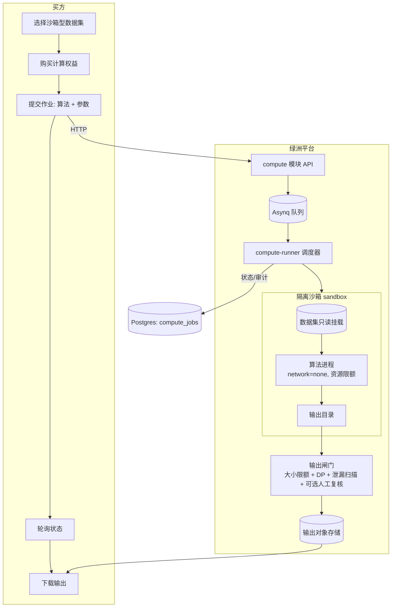

# 绿洲 · 隐私计算与「可用不可见」设计文档（Compute-to-Data）

**日期**：2026-06-02
**状态**：方案初稿（供新会话评审后开工；本文不含已落地代码，仅设计）
**范围**：在现有"买即下载原始数据"之上，新增**数据沙箱 / 计算到数据（Compute-to-Data, C2D）**能力——买方获得**计算结果**（模型/统计/查询）而非原始数据，实现"可用不可见"。
**作者**：平台技术

> 本文是一次**大方向**立项设计，预计 4 个阶段、多个 PR。**先评审、后开工**。新会话请先读 §0。

---

## 0. 给新会话的上手须知（READ FIRST）

> 新会话没有上下文记忆。本节让你在不依赖历史对话的情况下能独立开工。

### 0.1 项目是什么
**Verdant Oasis（绿洲）** 是一个**面向中国市场的 AI 训练数据交易平台**。理念："在数据荒漠中筑起一片纯净绿洲"。运营主体：杭州科农绿洲生物科技有限公司。

### 0.2 代码与分支
- 代码在 **`~/ai-data-marketplace`**（git 仓库，远程 `origin` = GitHub `exergyleizhou-ux/ai-data-marketplace`，默认分支 `main`）。
- **当前 `~/ai-data-marketplace` 这棵工作树停在旧分支 `feat/h3-settlement-outbox`，且有一堆早期未跟踪文件——不要在那棵树上直接干活。**
- 真实最新代码看 **`origin/main`**（`git fetch origin` 后以 `origin/main` 为准）。
- **工作流（务必遵守）**：每个任务 `git worktree add ~/ai-data-marketplace-<name> -b feat/<name> origin/main` 建独立工作树 → 本地全验证 → push → `gh pr create --base main` → 看 CI 三个 job 全绿 → `gh pr merge --squash --delete-branch` → `git worktree remove`。一棵树只做一件事，不混用。

### 0.3 技术栈与工具链（手装在 ~ 下，需手动 PATH）
- **Go 1.23**：`~/.local/bin/go`（`export PATH="$HOME/.local/bin:$PATH"`）。后端：gin + pgx/v5 + pgxpool + Postgres，模块化单体，Asynq（Redis）异步 worker，对象存储抽象（本地/S3/MinIO）。
- **Node 20**：`~/sdk/node/bin`。前端：Next.js（app router）+ React + Tailwind + TypeScript。
- **Postgres**：`~/sdk/pg/bin`（server-only，无 psql）。本地起临时库验证迁移/SQL：`initdb` → `pg_ctl -o "-p <port> -k <sock> -c listen_addresses=''" start`，连 `postgres://postgres@/postgres?host=<sock>&port=<port>`，用 `db.RunMigrations(dsn)` 跑迁移。
- **Python 3.11** venv：`~/sdk/sidecar-venv`（已装 PaperGuard 2.17.0、pyarrow、mlcroissant、fastapi）。
- **CI**（`.github/workflows/ci.yml`）三 job：`backend`（gofmt gate + vet + build + `go test -race` 连真 Postgres service）、`frontend`（tsc + lint + build）、`sidecar`（装 PaperGuard 跑 pytest）。所有 PR 必须三 job 全绿。

### 0.4 后端约定（照抄现有模式）
- 模块在 `backend/internal/modules/<name>/`：`model.go`（DTO/常量/错误）、`repo.go`（`Repository` 接口 + `pgRepo` 实现 + `scanXxx`）、`service.go`（业务，依赖 `Repository` 接口，单测用内存 `fakeRepo`）、`handler.go`（gin handler）、`router.go`（注册路由）、`doc.go`、`*_test.go`。
- HTTP 统一 `internal/platform/httpx`（`httpx.OK`、`httpx.Fail`、`httpx.UserID(c)`）。审计 `internal/platform/audit`。指标 `internal/platform/metrics`。
- 真库集成测试：`*_integration_test.go` 用 `os.Getenv("DATABASE_URL")` 门控（不设则 `t.Skip`），CI 的 backend job 会设 `DATABASE_URL` 跑它们。
- **迁移**：`backend/migrations/0000NN_xxx.up.sql` / `.down.sql`，embed 进二进制（`migrations/embed.go`），`db.RunMigrations` 应用。**当前最高 000009，下一个 000010。**

### 0.5 现有相关能力（C2D 要复用/集成的）
- **dataset 模块**：数据集 CRUD、上传（分片）、质检流水线（format/stats/dedup/pii/pii_redaction/authenticity/schema 写入 `quality_checks`）、来源声明、状态机（draft→uploading→checking→reviewing→published→...）。
- **order/payment/delivery 模块**：订单状态机、Stripe Connect + 微信/支付宝分账结算、交付（临时下载链接 + 交付指纹）。
- **已建只读端点**（dataset）：`GET /datasets/:id/quality`（质检报告）、`/schema`（在 quality 里）、`/croissant`（MLCommons JSON-LD）、`/versions`、`/certificate`（数据存证凭证·一数一码 = `VO-<SHA256(datasetID:contentSHA)前12hex>`）、Datasheet（数据说明卡）。
- **法律**：`/terms`、`/privacy` 已按律师定稿（中英双语，`frontend/components/Legal.tsx` 为品牌+条款源，`frontend/lib/legal.ts` 管版本触发重新同意）。

---

## 1. 背景与目标

### 1.1 现状与缺口
当前模式：买方下单 → 付款 → **下载原始数据**（gated 链接 + 交付指纹）。问题：
- 原始数据一旦交付即**脱离平台控制**，可被二次扩散，卖方议价与维权困难。
- 高敏感/高价值数据（医疗、金融、独家语料）卖方**不愿出售原始拷贝**。
- 这正是中国数据交易所（上海/北京/深圳）的核心命题：**数据"可用不可见"、不出域**。

### 1.2 目标
让买方获得**数据的价值**（训练好的模型、统计结果、查询答案）而**不获得原始数据本身**。即在现有"下载型"商品之外，新增**"沙箱计算型 / 可用不可见型"**商品。

### 1.3 非目标（本期不做）
- 不替换现有下载型交易（二者并存，卖方按数据集选择售卖模式）。
- 不自研密码学原语（MPC/同态用成熟库，不手搓）。
- Phase 1 不追求"平台也不可见"（那是 TEE 阶段，见 §2）。

---

## 2. 信任阶梯（核心概念，务必先对齐）

"可用不可见"不是一个开关，而是**逐级增强的信任模型**。设计必须区分"对谁不可见"：

| 级别 | 名称 | 对**买方**不可见？ | 对**平台**不可见？ | 技术 | 本方案阶段 |
|---|---|---|---|---|---|
| **L0** | 下载型（现状） | ❌ 买方拿到原始数据 | ❌ | 直接交付 | 已有 |
| **L1** | **数据沙箱（买方不可见）** | ✅ 买方只拿输出 | ❌ 平台跑沙箱仍可见数据 | 隔离容器 + egress 阻断 + 输出闸门 | **Phase 1–2** |
| **L2** | **机密计算（平台也不可见）** | ✅ | ✅ 数据仅在 TEE 内解密 | TEE + 远程证明 | **Phase 3** |
| **L3** | **数据不出域** | ✅ | ✅ | 联邦学习 / MPC（跨多卖方，数据不集中） | **Phase 4** |

> **关键诚实点**：L1 = "**买方**可用不可见"，平台运营方仍能访问数据（和现状一样，平台本就托管数据）。只有 L2（TEE）才是"**连平台都不可见**"的真·可用不可见。产品文案与法律条款必须如实区分，不可把 L1 宣传成 L2（与绿洲一贯的"信号非结论/不夸大"立场一致）。
>
> 每一级都叠加 **差分隐私（DP）** 对输出加噪/限额，防止"把原始数据编码进输出"的泄漏（§8）。

参考实现（对标，辩证吸收）：Ocean Protocol **Compute-to-Data**（最清晰的开源 C2D 架构）；国内**翼方健数、华控清交、蓝象智联、蚂蚁摩斯、富数科技**；北京国际大数据交易所 **IDeX 测试沙箱**；上海数交所"数据产品登记凭证 + 全链路存证"。

---

## 3. 总体架构（Compute-to-Data）

核心：买方提交**计算作业（job）**，平台在**数据所在的隔离环境**里运行，只回**输出**，原始数据永不离开。



**生命周期状态机（`compute_jobs.status`）**：
```
created → queued → running → output_pending → (review?) → released
                          ↘ failed            ↘ rejected
```
- `created`：作业已创建（已校验权益、算法、参数）。
- `queued`：已入 Asynq 队列。
- `running`：沙箱执行中。
- `output_pending`：执行完成，输出进入闸门（DP/大小/泄漏/人工）。
- `released`：输出已放行，买方可下载。
- `failed`/`rejected`：执行失败 / 输出被闸门拒绝。

**组件**（新增）：
1. `compute` 后端模块（owns `compute_jobs`/`algorithms`/`compute_entitlements`）。
2. **compute-runner**（沙箱执行器）：独立服务/worker，负责拉数据→起隔离容器→跑算法→收输出。**复刻 PaperGuard sidecar 模式**（独立进程、清晰契约、可独立伸缩）。
3. **输出闸门**：大小限额 + DP 加噪 + 泄漏启发式 + 可选人工复核。

---

## 4. 数据模型（迁移 000010）

```sql
-- 算法登记：经平台审核的可信算法（白名单），以及买方自定义镜像（高级、需更强隔离）
CREATE TABLE algorithms (
    id            UUID PRIMARY KEY DEFAULT gen_random_uuid(),
    owner_id      UUID REFERENCES users (id),         -- NULL = 平台内置
    name          TEXT NOT NULL,
    runtime       TEXT NOT NULL,                       -- 'python-sklearn' | 'python-lightgbm' | 'sql' | 'custom-image'
    image         TEXT NOT NULL,                       -- 容器镜像引用（白名单基础镜像或卖方/平台审核镜像）
    entrypoint    TEXT NOT NULL DEFAULT '',
    params_schema JSONB,                               -- 参数 JSON Schema（前端据此渲染表单 + 后端校验）
    output_kind   TEXT NOT NULL,                       -- 'model' | 'metrics' | 'table' | 'aggregate'
    status        TEXT NOT NULL DEFAULT 'pending'      -- pending | approved | rejected | disabled
                       CHECK (status IN ('pending','approved','rejected','disabled')),
    trusted       BOOLEAN NOT NULL DEFAULT false,      -- 平台审核通过、可对敏感数据运行
    created_at    TIMESTAMPTZ NOT NULL DEFAULT now(),
    updated_at    TIMESTAMPTZ NOT NULL DEFAULT now()
);

-- 数据集的沙箱售卖配置（与下载型并存；一个数据集可同时开放下载/沙箱）
CREATE TABLE dataset_compute_offers (
    dataset_id        UUID PRIMARY KEY REFERENCES datasets (id) ON DELETE CASCADE,
    enabled           BOOLEAN NOT NULL DEFAULT false,
    allow_custom      BOOLEAN NOT NULL DEFAULT false,  -- 是否允许买方自定义算法（否=仅白名单）
    allowed_algorithm_ids UUID[] NOT NULL DEFAULT '{}', -- 卖方允许的算法子集（空=全部 approved）
    price_cents       BIGINT NOT NULL DEFAULT 0,        -- 单次作业价（或权益价）
    max_runtime_secs  INT NOT NULL DEFAULT 1800,
    max_output_bytes  BIGINT NOT NULL DEFAULT 10485760, -- 10 MiB 输出上限（防整库导出）
    dp_epsilon        DOUBLE PRECISION,                 -- 该数据集默认 DP 预算（聚合型输出）
    trust_level       TEXT NOT NULL DEFAULT 'L1'        -- L1 | L2 | L3（见 §2）
                           CHECK (trust_level IN ('L1','L2','L3')),
    updated_at        TIMESTAMPTZ NOT NULL DEFAULT now()
);

-- 买方计算权益（一次购买可含 N 次作业额度）
CREATE TABLE compute_entitlements (
    id            UUID PRIMARY KEY DEFAULT gen_random_uuid(),
    dataset_id    UUID NOT NULL REFERENCES datasets (id) ON DELETE CASCADE,
    buyer_id      UUID NOT NULL REFERENCES users (id) ON DELETE CASCADE,
    order_id      UUID REFERENCES orders (id),         -- 复用现有支付/结算
    jobs_quota    INT NOT NULL DEFAULT 1,
    jobs_used     INT NOT NULL DEFAULT 0,
    expires_at    TIMESTAMPTZ,
    created_at    TIMESTAMPTZ NOT NULL DEFAULT now()
);

-- 计算作业
CREATE TABLE compute_jobs (
    id              UUID PRIMARY KEY DEFAULT gen_random_uuid(),
    dataset_id      UUID NOT NULL REFERENCES datasets (id) ON DELETE CASCADE,
    version_id      UUID REFERENCES dataset_versions (id),
    buyer_id        UUID NOT NULL REFERENCES users (id) ON DELETE CASCADE,
    entitlement_id  UUID NOT NULL REFERENCES compute_entitlements (id),
    algorithm_id    UUID REFERENCES algorithms (id),
    params          JSONB,
    status          TEXT NOT NULL DEFAULT 'created'
                         CHECK (status IN ('created','queued','running','output_pending','released','failed','rejected')),
    dp_epsilon      DOUBLE PRECISION,
    output_key      TEXT,                              -- 输出对象存储 key
    output_bytes    BIGINT,
    output_kind     TEXT,
    error           TEXT,
    attestation     JSONB,                             -- L2 TEE 远程证明报告（Phase 3）
    created_at      TIMESTAMPTZ NOT NULL DEFAULT now(),
    started_at      TIMESTAMPTZ,
    finished_at     TIMESTAMPTZ
);
CREATE INDEX idx_compute_jobs_buyer ON compute_jobs (buyer_id, created_at DESC);
CREATE INDEX idx_compute_jobs_status ON compute_jobs (status);

-- 数据集每个买方的 DP 预算消耗（防多次查询累计泄漏；Phase 2+）
CREATE TABLE dp_budget_ledger (
    id            UUID PRIMARY KEY DEFAULT gen_random_uuid(),
    dataset_id    UUID NOT NULL REFERENCES datasets (id) ON DELETE CASCADE,
    buyer_id      UUID NOT NULL REFERENCES users (id) ON DELETE CASCADE,
    job_id        UUID REFERENCES compute_jobs (id),
    epsilon_spent DOUBLE PRECISION NOT NULL,
    created_at    TIMESTAMPTZ NOT NULL DEFAULT now()
);
```

---

## 5. 后端模块 `compute`（照现有模式）

`backend/internal/modules/compute/`：
- `model.go`：`Algorithm`、`ComputeOffer`、`ComputeJob`、`Entitlement` DTO + 状态常量 + 错误。
- `repo.go`：`Repository` 接口（CreateJob/GetJob/ListJobsByBuyer/AdvanceStatus/SetOutput/RegisterAlgorithm/ListApprovedAlgorithms/GetOffer/UpsertOffer/SpendDP/...）+ `pgRepo` + `fakeRepo`（测试）。
- `service.go`：业务——权益校验、算法白名单校验、参数 JSON Schema 校验、入队、状态推进、与 `order` 模块集成（购买权益）、与 `delivery` 集成（输出交付）。**通过接口依赖 dataset/order，不互相 import 内部**（沿用现有跨模块边界约定）。
- `handler.go` / `router.go`：见 §6。
- `runner.go` + **compute-runner sidecar**：见 §7。

**与现有模块集成**：
- **支付**：购买计算权益 = 创建一个 `order`（type=compute），走现有 Stripe Connect/分账结算。`compute_entitlements.order_id` 关联。
- **交付**：作业输出走现有 `delivery` 模块（临时链接 + 指纹）。
- **质量/存证**：沙箱型数据集照样有质检/Schema/存证凭证；商品页加"可用不可见"徽章 + 信任级别（L1/L2/L3）。

---

## 6. API 契约

**卖方（authed, owner）**
- `PUT /datasets/:id/compute-offer` — 开启/配置沙箱售卖（enabled, allow_custom, allowed_algorithm_ids, price, limits, trust_level, dp_epsilon）。
- `GET /datasets/:id/compute-offer` — 读配置（公开只读给买方看价/级别）。

**买方（authed）**
- `GET /algorithms?dataset_id=` — 该数据集可用的已审核算法 + 参数 schema。
- `POST /datasets/:id/compute/purchase` — 购买计算权益（创建 order → 付款 → entitlement）。
- `POST /compute/jobs` — 提交作业 `{ dataset_id, entitlement_id, algorithm_id, params }`（或自定义镜像，若 offer 允许）。返回 job。
- `GET /compute/jobs/:id` — 轮询状态/错误/输出元信息。
- `GET /compute/jobs/:id/output` — 放行后下载输出（经 delivery）。
- `GET /users/me/compute/jobs` — 我的作业列表。

**运营（ops）**
- `GET /admin/algorithms?status=pending` / `POST /admin/algorithms/:id/review` — 算法审核（approved/rejected/trusted）。
- `GET /admin/compute/jobs?status=output_pending` / `POST /admin/compute/jobs/:id/output-review` — 输出人工复核（放行/拒绝），用于高敏感数据集。

---

## 7. 沙箱与安全（威胁模型——本方案最关键部分）

### 7.1 威胁与对策
| 威胁 | 对策 |
|---|---|
| 算法**网络外传**原始数据 | 容器 `--network none`（无任何网络），无 DNS、无出站 |
| 算法**读取host/其他数据** | 只读挂载本数据集到固定路径；rootfs 只读；无 host FS、无 docker.sock；seccomp/AppArmor/最小 capabilities |
| 算法把**原始数据编码进输出** | 输出**大小硬上限**（`max_output_bytes`）+ 聚合型输出走 **DP**（§8）+ **算法白名单**（敏感数据只许 trusted 算法）+ **可选人工复核** |
| 资源耗尽 / 死循环 | CPU/内存/PID/磁盘配额 + `max_runtime_secs` 超时杀进程 |
| 镜像投毒 | 仅白名单基础镜像；自定义镜像需 ops 审核 + 镜像签名校验 |
| 多次查询**累计泄漏** | `dp_budget_ledger` 按 (数据集,买方) 记账，超预算拒绝（§8） |
| 平台内鬼/主机被攻破（L2 目标） | TEE 机密计算 + 远程证明（§9）——数据仅在 enclave 内明文 |

### 7.2 沙箱运行时选型（按隔离强度递进）
- **Phase 1（开发/MVP）**：Docker + `--network none` + 只读挂载 + 资源 limits + seccomp 默认 profile。够验证全链路。
- **Phase 2（生产隔离）**：**gVisor（runsc）** 或 **Firecracker microVM**（用户态内核/微虚机，强隔离，启动快）。
- **Phase 3（L2 机密计算）**：**Confidential VM / TEE**——阿里云加密计算/Intel TDX、Azure Confidential VM（AMD SEV-SNP）、GCP Confidential VM；或 SGX + **Gramine**。配**远程证明**写入 `compute_jobs.attestation`，卖方可验。

> **compute-runner = 独立 sidecar 服务**（像 paperguard-sidecar）：Go 后端通过队列/HTTP 把作业交给 runner；runner 负责容器编排。这样后端不直接碰容器运行时，便于把 runner 部署到带 TEE 的专用节点。

---

## 8. 差分隐私（DP）与输出治理
- **聚合/统计/查询型输出**（output_kind=aggregate/metrics）：用成熟 DP 库（**OpenDP**、Google **differential-privacy**、IBM **diffprivlib**）对结果加拉普拉斯/高斯噪声，按 `dp_epsilon` 控制。
- **DP 预算记账**：每次作业消耗 ε 写 `dp_budget_ledger`；同一 (数据集,买方) 累计 ε 超上限则拒绝新作业（防"多次查询逼近原始值"）。
- **模型型输出**（output_kind=model）：DP 难直接套；靠 **算法白名单 + 输出大小限额 + 训练用 DP-SGD（可选）+ 人工复核**。可选做**成员推断/记忆化检测**（高级）。
- **泄漏启发式**：输出与原始数据相似度扫描（如输出行数/熵接近原始 → 拒绝）。

---

## 9. L2/L3 路线（Phase 3–4）
- **L2 机密计算（平台不可见）**：沙箱跑进 TEE；数据用卖方密钥加密，**仅在 enclave 内解密**；**远程证明**向卖方证明"只有约定代码在真 enclave 内处理了数据"。产出 `attestation` 报告，商品页展示"L2·机密计算"徽章。
- **L3 数据不出域（联邦/MPC）**：
  - **联邦学习**：多卖方各自本地训练，平台只聚合梯度/参数（FedAvg）；原始数据不集中。适合"多卖方联合训练一个模型"。
  - **MPC**：秘密分享 + 联合计算，适合**跨数据集联合统计/隐私求交（PSI）/联合建模**（线性模型、风控评分）。用 **Secretflow（蚂蚁，开源）/ FATE / MP-SPDZ** 等成熟框架，不自研。

---

## 10. 与支付 / 法律 / 品牌的集成
- **支付**：计算权益购买 = order（现有分账结算）。定价：按次（per-job）或按权益额度。卖方在 offer 设价。
- **法律（必须新增条款）**：现行《用户服务协议》是"数据交付"模型。C2D 需**新增条款**：①沙箱型交易**不交付原始数据**，仅交付计算结果；②买方对其提交算法的合法性/安全性负责；③输出物的知识产权归属与使用范围；④L1/L2/L3 的"可用不可见"**如实界定**（L1 平台可见、L2 平台不可见），不得夸大。→ 走现有 `Legal.tsx` + `lib/legal.ts` 版本号 bump 触发重新同意。
- **质量/存证**：沙箱型数据集照样质检 + 存证凭证；商品页加 **"可用不可见 L1/L2/L3"** 徽章。
- **品牌**：与"纯净绿洲 / 信号非结论"一致——文案如实标注信任级别，不夸大。

---

## 11. 分阶段 PR 计划

| 阶段 | 目标 | 主要 PR（建议拆分） | 验收 |
|---|---|---|---|
| **P1 全链路打通（L1, Docker 沙箱）** | 买方能购买权益→提交白名单算法作业→拿到输出，原始数据不交付给买方 | ①迁移000010 + compute 模型/repo（真库集成测试）②service 状态机 + 权益/算法校验（单测）③API + 前端（卖方开启 offer、买方提交作业/轮询/下载）④compute-runner sidecar（Docker `--network none` 跑一个内置 sklearn 算法）⑤一条内置算法（如"训练逻辑回归并返回模型+指标"） | `go test -race` 全绿；本地 docker 沙箱端到端跑通一个真实作业；迁移对真 PG 通过；前端 tsc/lint/build |
| **P2 隔离硬化 + 输出治理** | 生产级隔离 + 防输出泄漏 | ①gVisor/Firecracker 运行时 ②输出闸门（大小限额、DP 加噪、泄漏启发式）③DP 预算记账 ④算法审核工作流（ops）⑤资源/超时限额 | 渗透式测试：算法无法外传/读越权；DP 预算超限被拒；超时被杀 |
| **P3 L2 机密计算（TEE）** | 平台也不可见 + 远程证明 | ①Confidential VM/TEE runner ②卖方密钥加密数据、enclave 内解密 ③远程证明写 attestation + 卖方可验 + 商品页徽章 | 证明报告可被独立验证；数据在 host 上始终密文 |
| **P4 L3 数据不出域** | 联邦/MPC | ①联邦学习聚合（FedAvg）②MPC 隐私求交/联合统计（Secretflow/MP-SPDZ）③跨数据集联合作业 | 多方端到端；原始数据不集中 |
| **法律（并行）** | C2D 条款 | ToS 新增 C2D 章节 + bump LEGAL_VERSIONS | 律师确认；重新同意生效 |

> **建议先做 P1 的最小切片**（§15），把"购买→作业→输出"骨架立起来，再逐级加固。

---

## 12. 技术选型小结
| 维度 | 选型 |
|---|---|
| 沙箱（P1→P3） | Docker `--network none` → gVisor/Firecracker → Confidential VM/TEE(TDX/SEV-SNP/SGX+Gramine) |
| 算法运行时 | Python 容器（sklearn/lightgbm/pandas）；SQL 查询型；自定义镜像（审核+签名） |
| DP | OpenDP / Google DP / diffprivlib |
| 联邦/MPC（P4） | Secretflow（蚂蚁开源）/ FATE / MP-SPDZ |
| 编排 | Asynq 入队 + compute-runner sidecar（独立服务，复刻 paperguard-sidecar 模式） |
| 远程证明（P3） | 云厂商 attestation API / 开源 enclave 工具链 |

---

## 13. 本地开发与验证
- **沙箱**：开发机用 Docker（`docker run --rm --network none --read-only -v <data>:/data:ro -v <out>:/out --memory=512m --cpus=1 --pids-limit=128 <algo-image>`）。**注意当前环境无 docker 时**，P1 可先做一个**进程级 mock runner**（在受限子进程里跑，env 注入 `NO_NETWORK`），把状态机/契约/前端先打通，再换真容器（设计上 runner 是接口，mock/docker/gVisor/TEE 可替换）。
- **DB**：临时 PG（见 §0.3）跑迁移 + 集成测试。
- **CI**：backend job 跑 compute 的真库集成测试；新增算法镜像构建可放独立 job（或先不入 CI，文档说明）。
- **验证铁律**（沿用本仓库一贯做法）：每个 PR 本地 `go test -race` + gofmt + vet + 前端 tsc/lint/build + 迁移/SQL 对真 PG 验证；CI 三 job 全绿才合并。

---

## 14. 待决策清单（评审拍板）
1. **首发形态**：先做"**查询/统计型**（SQL + DP，简单、安全、快出）"还是"**训练型**（返回模型，价值高但泄漏面大）"？建议 **P1 先训练型的一个白名单算法**（逻辑回归/LightGBM）跑通骨架，统计型紧随。
2. **自定义算法**：P1 是否允许买方自定义镜像？建议 **P1 仅白名单**（安全面小），自定义留 P2 + 审核。
3. **TEE 云厂商**：阿里云加密计算 / Azure CVM / 自建 SGX？影响 P3。
4. **DP 默认 ε** 与预算上限：需业务/合规定。
5. **定价模型**：按次 vs 按权益额度 vs 包月。
6. **compute-runner 部署**：与后端同机（开发）vs 专用隔离节点（生产，尤其 TEE）。
7. **是否接入数据交易所**：上海/北京数交所对"沙箱/可用不可见"有对接规范，是否对齐其登记凭证。

---

## 15. 附：P1 最小切片落地清单（新会话可直接开工）

> 目标：买方购买计算权益 → 提交一个**内置白名单算法**（"训练逻辑回归，返回模型文件 + 准确率"）→ 平台在 **Docker `--network none` 沙箱**（无 docker 时用 mock runner）里跑 → 买方下载**输出**，**全程不向买方交付原始数据**。

1. **迁移 `000010_compute.up/down.sql`**：建 `algorithms`、`dataset_compute_offers`、`compute_entitlements`、`compute_jobs`（§4 的子集，DP 表留 P2）。
2. **`compute` 模块**：model/repo/service/handler/router/doc + `fakeRepo`。
   - Repository：`UpsertOffer/GetOffer`、`RegisterAlgorithm/ListApprovedAlgorithms`、`CreateEntitlement/GetEntitlement/SpendQuota`、`CreateJob/GetJob/AdvanceStatus/SetOutput/ListJobsByBuyer`。
   - service 状态机 + 权益/额度校验 + 参数 JSON Schema 校验 + 入队。
   - **真库集成测试**：建 user/dataset/offer/algorithm/entitlement → CreateJob → AdvanceStatus → SetOutput → 校验。
3. **compute-runner**：定义 `Runner` 接口 `Run(ctx, job, dataReader) (outputKey, err)`；提供 `dockerRunner`（`--network none` 跑算法镜像）+ `mockRunner`（受限子进程，开发/无 docker 时用）。Asynq worker 消费 `compute:job`。
4. **一个内置算法镜像**：`algorithms/logreg/`（Python：读 `/data` CSV → 训练 LogisticRegression → 写 `/out/model.pkl` + `/out/metrics.json`），白名单 approved+trusted。
5. **支付**：`POST /datasets/:id/compute/purchase` 创建 order（复用现有支付），成功后建 entitlement。
6. **前端**：
   - 卖方（sell 工作台）：每个数据集"开启沙箱售卖"开关 + 选允许算法 + 定价。
   - 买方（数据集详情页）：若 offer.enabled → "可用不可见"徽章 + "购买计算权益" → 选算法/填参数 → 提交作业 → 作业列表轮询 → 下载输出。
7. **法律**：ToS 加 C2D 段（并行，bump 版本）。
8. **验证**：`go test -race`、gofmt/vet、前端 tsc/lint/build、迁移对真 PG、本地 docker 沙箱端到端、CI 三 job 全绿。

> 落地后即实现 **L1「买方可用不可见」**：买方拿到模型与指标，**从未拿到原始数据**。后续按 §11 逐级加固到 L2/L3。
